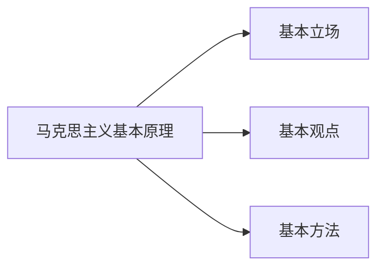
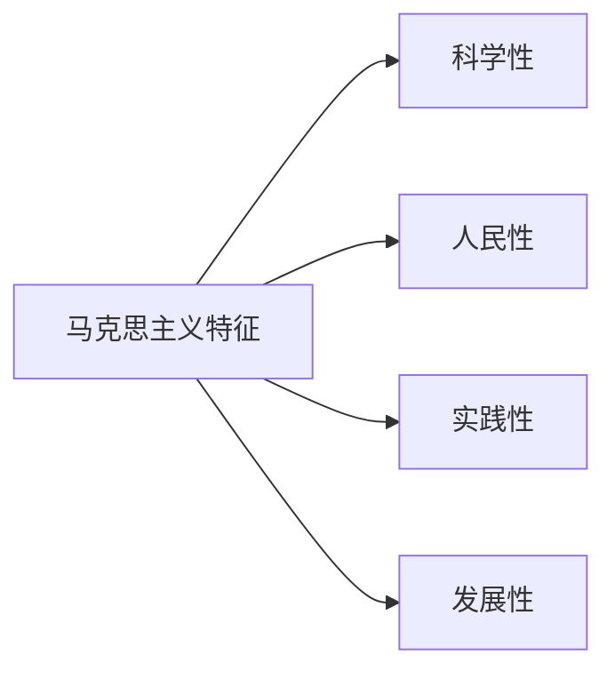
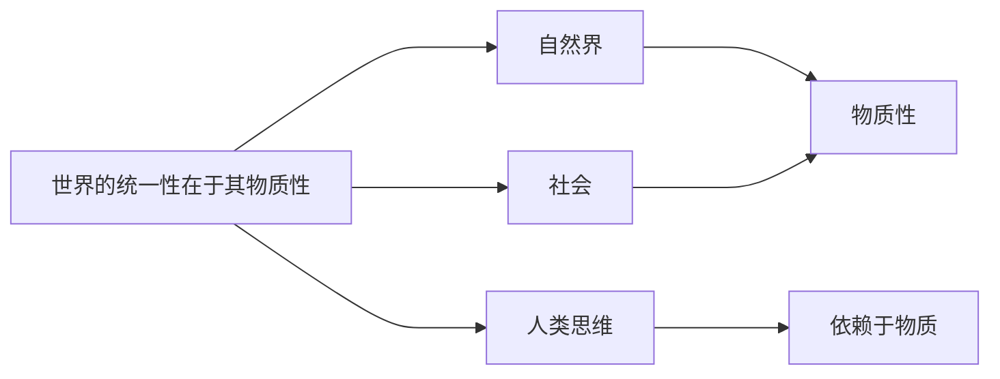
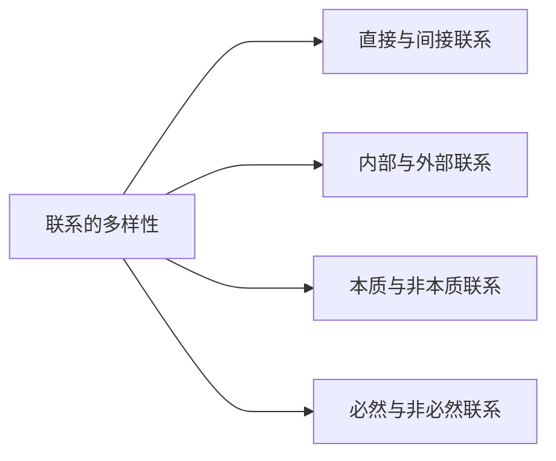
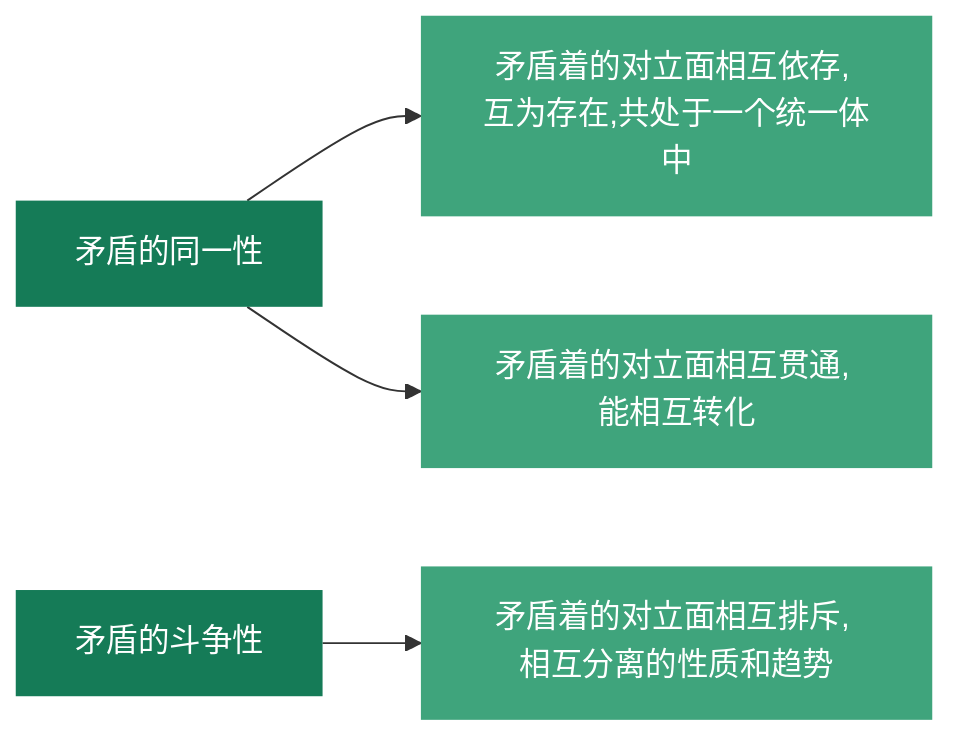
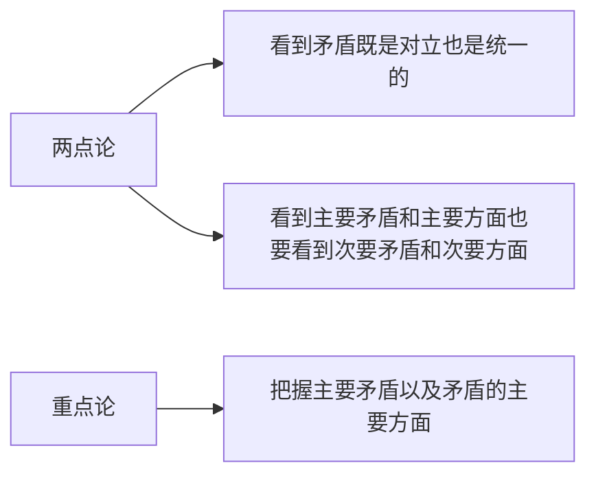
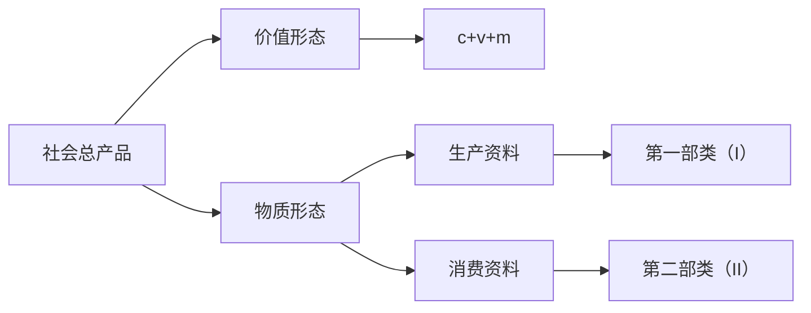

# 马克思主义基本原理 笔记

## 什么是马克思主义

**在讨论什么是马克思主义之前，我们先来看看什么是主义：**
首先，主义是有强的排他性的。同时，主义本身是一种主张、观点、思想，我*个人认为*还应当是较为系统的。

下面我们来阐述什么是马克思主义：

1. 由马克思（1818-1883）和恩格斯创办并由后继者发扬光大的科学理论体系

2. 包含马克思主义哲学（世界观、方法论）

   > 关于自然、社会、人类思维的发展的一般规律的学说

3. 包含马克思主义政治经济学

   > 关于社会主义必然替代资本主义，最终实现共产主义的学说

4. 包含科学社会主义

   > 关于无产阶级解放、 全人类解放和每个人自由而全面发展的学说

5. 有当代的价值

   > 是无产阶级政党和社会主义国家的指导思想，是指引人民创造美好生活的行动指南

注意：**狭义的马克思主义**指由马克思和恩格斯创立的基本理论、基本观点和学说的体系。**广义上**，马克思主义不仅指马克思恩格斯创立的基本原理论、基本观点论和学说体系，也包括继承者对它的发展，及在实践中不断的发展着的马克思主义。

## 马克思主义基本原理的基本方面

笼统地说，其分为**基本立场、基本观点、基本方法**三个方面。

### 马克思主义基本立场

值得指出的是，几乎所有主张和主义都是有所指向的，意味着每一个观点和主义都是有服务的对象、有固有不变的立场、有所追求的利益。*比如，斯多葛主义的对象是所有人，希望所有人获得永恒的安宁并习得德行。*对马克思主义来说，这就是**为大多数人发声，以多数人的利益为核心。**落到中国的特色社会主义中，那便是**扶贫**，**共同富裕**。

### 马克思主义基本观点

总结地说，其包括了自然、社会、人类思维的发展的一般规律的科学认知（马克思主义世界观、方法论）。最耳熟能详的比如：物质决定意识；事物矛盾运动规律的问题；实践和认知的辩证关系等等。

### 马克思主义基本方法

这就是指导人们落实马克思理论于实践中的内容。

>### 资本主义国家和社会主义国家极大的区别在哪里？
>
>前者由资本控制政府，后者由政府控制资本。
>
>### 社会主义国家为何要使用公有制？
>
>我们考虑一个私有的资本。其不可避免地要寻求升值，则将作为生产资料投入生产过程中去。而当这样的私有资本想要获得作为参与生产过程的报酬时，不可避免的会有更多倾向于这一私有资本而非工人或是生产过程中的其他人。若试图强制地降低对私有资本的报酬，不可避免的导致其参与生产的积极性降低，而反过来人民却一直无法跨越贫富差距的鸿沟。如此以往，贫富差距只会将进一步扩大（我们注意贫富差距是相对差距）。马克思认为，要解决这个问题，只能从破除私有化的角度入手，将生产资料公有化。这也是为什么我们国家有国企存在的原因。

## 马克思主义的创立与发展

### 马克思和恩格斯生活的时代背景

1. 资本主义生产方式在西欧有相当的发展（并产生了激烈的社会矛盾）
2. 工业革命和科技进步大大提高了劳动生产率
3. 社会两极分化，工人极其贫困（生产社会化和生产资料私有化的矛盾）
4. 经常爆发周期性经济危机
5. *无产阶级在反抗资产阶级的过程中产生了理论指导的需求*

### 马克思主义的理论来源

1. 以黑格尔为代表的**德国古典哲学**==（直接理论来源）==
2. 以亚当·斯密为代表的**英国古典政治经济学**
3. 以圣西门、傅立叶、欧文为代表的**英法空想社会主义**

### 马克思主义的诞生

1848年，英国伦敦，《共产党宣言》的发表标志着马克思主义的诞生。

## 马克思主义的鲜明特征

概括地说，马克思主义的鲜明特征就是**科学性和革命性的统一**。革命性就是马克思主义人民性、实践性和发展性的**应有之义和必然特征**。

### 科学性

表现为拥有科学的世界观和方法论（历史唯物主义和辩证唯物主义）

这里我们区分一下自然科学的科学性和人文社科中的科学性。前者是指能被证实或证伪的不论对错的；后者是指正确的。

### 人民性

**人民至上**是马克思主义学说的基本立场。其学说的根本目的：**为人类求解放**。

### 实践性

从实践中来，到实践中去，在实践中经受检验，随实践不断发展。

### 发展性

能做到**与时俱进**。

## 马克思主义的当代价值

[0.3 马克思和他的学说（2）：世代传唱的“时代的歌中之歌”14'](https://www.icourse163.org/learn/WHU-1001717003?tid=1450264454#/learn/content?type=detail&id=1214541713)

[0.4 日出东方：马克思主义如何改变中国14'](https://www.icourse163.org/learn/WHU-1001717003?tid=1450264454#/learn/content?type=detail&id=1214541714)

[0.5 一个流行的问题：马克思主义在今天是否过时14'](https://www.icourse163.org/learn/WHU-1001717003?tid=1450264454#/learn/content?type=detail&id=1214541715&cid=1218328738&replay=true)

## 世界的物质性及发展规律

### 世界多样性与物质统一性

**世界观**是人们对整个世界的总体看法和根本观点。

**方法论**是人们认识和改造世界所遵循的根本方法的学说和理论体系。

**哲学**是系统化、理论化的世界观，也是方法论。因为有什么样的世界观，就有什么样的方法论。

> ### 什么是哲学的重大基本问题
>
> 从哲学的角度，所有事物都能归为两类：物质现象和精神现象。所以讨论存在和思维（又说物质和精神，客观和主观，物质和意识）的关系是较为重要的。其中关于物质和意识孰为本源的问题，称为**第一性问题**，形成了唯物主义和唯心主义这两个对立的学说；其中关于意识能否正确、彻底地反应或理解存在之物的问题，称为**统一性问题**，形成了可知论和不可知论。

在**古代朴素唯物主义**中，有两大理论我们可称之为巅峰，一则西方德谟克利特的原子论，二则中国的元气说。其最大的问题在于，其直观性、猜测性的特点，导致这样的理论不能的大科学的证实。

在**近代形而上学**中，虽然理解了原子的存在，但是**不能正确理解哲学的物质概念和自然科学的物质概念之间共性和个性的关系**。

> ### 什么是形而上学
>
> #### 从学科的意义上来说
>
> 形而上学是指，理论的，抽象的意思
>
> #### 从哲学的意义上来说
>
> 形而上学指这样的认识世界的过程：分割整体并单独进行分析，但是**没有对世界的整体认知**

为了停止人们对**物质**从哪里来的无尽的追问（主要是说哲学意义上的而非自然科学意义上的），恩格斯做出这样的总结：“物、物质无非就是各种物的总和，而这个概念就是从这一总和中抽象出来的。”

20世纪，列宁重新定义物质的概念：

1. 是标志客观实在的哲学范畴
2. 人们通过感觉感知这样的客观实在（被人类意识反应）
3. 这样的客观实在不依赖我们而存在

****

既然对物质的概念些许明确的认识了，我们下面来讨论一下**物质存在的方式**。

马克思主义认为，物质的运动是**绝对的、无条件的**，而物质的静止（相对静止）则是相对的、有条件的。后者所指的具体有两种（静止的表现形式）：空间的相对位置暂时不变，或是说事物的根本性质暂时不变。
同时考虑到物质是在时间和空间中存在的，我们对时间和空间进行考察。时间让物质运动有**持续性、顺序性、一维性**；空间让物质运动有**广延性、伸长性、三维性**。物质运动与时间和空间不可分割，说明了时空有==客观性==；具体的物质形态的时空是==有限性的==，整个物质世界是==无限性的==。

总结地说，**物质、运动、时间、空间**是有**内在统一性**的，意味着我们想问题、办事情的时候，都要考虑具体的时间、地点、条件。

****

接下来我们讨论一下**意识**的问题，以及马克思主义认为的其与**物质**的相关联性。

自然界和社会的部分我们都好理解（需要强调的是，将自然界和人类社会统一的现实基础是**实践**），所以接下来我们会重点考察**人类思维**为什么是有**依赖于物质**的特性。马克思主义认为：首先，本质上，**意识是人脑的机能和属性，是客观世界的主观映像**，意味着本质上人脑产生了意识（我们这里讨论的意识特指人类意识）。接着，既然如此，意识，其**在内容上是客观的**，有现实物质基础可依据，是有客体原型、客观内容的（依据）；而其**在形式上是主观的**，是有主体差异和主观形式的（创造）。所以即使每个人对猫的所思所想不尽相同，但是都是基于客观存在的猫这样的生物而产生的。这样也不难理解人类思维为何依赖于物质，从而也说明了**世界的统一性在于其物质性**。

另一方面，从意识的起源来看：

1. 意识是**自然界长期发展的产物**（从低等动物的刺激感应性，到高等动物的感觉和心理，最后到人类的意识）
2. 意识也是**社会历史发展的产物**（社会实践，尤其是劳动，在意识到产生和发展中起到了决定性的作用）

但是我们又不得不承认，**意识对物质是有反作用的**。

1. 意识具有目的性和计划性
2. 意识具有创造性
3. 意识具有指导实践改造客观世界的作用
4. 意识具有调控人的行为和生理活动的作用

如此，我们需要理解**主观能动性和客观规律性是辩证统一**的。为何是统一的呢？因为**尊重客观规律是正确发挥主观能动性的前提**，而只有**发挥主观能动性，才能正确认识并利用客观规律**。那么如何正确发挥人的主观能动性呢？一则，**从实际出发**；二则，**认识到实践是正确发挥人主观能动性的根本途径**；三则，**发挥需要一定物质条件和手段**。

### 事物的普遍联系和变化发展（唯物辩证法）

这里，马克思主义提出了一个概念：**唯物辩证法**。我们可以拿形而上学和这个对比着来认识它。从哲学角度上来说，唯物辩证法是全面的观察世界的，而形而上学，相反的，是片面的、相孤立的观察世界的。所以，最重要的是，唯物辩证法认为：**万事万物都处在普遍联系之中，事物是`联系`、`发展`的**。==这便是唯物辩证法的总观点了。==（意味着唯物辩证法的总观点便是：普遍联系、永恒发展的两个观点）相对的，形而上学认为事物是静止的：比如微观经济学里的静态分析法。

下面我们挨个来看什么是`联系`,什么是`发展`。

****

什么是**联系**呢？联系是事物内部各要素之间和事物之间相互**影响**，相互**制约**，相互**作用**，产生变化和影响。

接下来我们来重点考察一下联系的**特征**，包括：**客观性、普遍性、多样性、==条件性==**。

#### 联系的客观性

首先，任何两个事物之间都是存在普遍联系的，换言之，**每一种事物都是在与其他事物的联系之中存在的**。而客观性就是指出我们必须从事物**本身固有的联系**出发去认识，而杜绝**主观臆断**的联系。后者就称之为主观辩证法了。

#### 联系的普遍性

这个普遍性有三层含义：

**第一层**，任何事物内部的要素是相互联系的；**第二层**，任何事物都不是孤立存在的，都是和其他事物处在一定的联系中的；**第三层**，整个世界是相互联系的、统一的整体。

#### 联系的多样性

事物间的联系是极为复杂、多种多样的。

#### 联系的条件性

1. 条件对事物发展和人的活动有**支持或者制约**作用
2. 条件是可以被改变的
3. 改变、创造条件不是任意的，是要遵循事物一般发展规律的

同时值得注意的是，事物间是存在普遍联系没错，但是落实到具体的联系，不一定任意两个事物之间是有这一特别联系的，这样具体、特别的联系是有相对应的条件的。这就是为什么我们要改变或者创造条件，因为这样做能改变一些事物间的联系（发挥主观能动性）。

****

什么是事物的变化呢？

首先，事物是处在不断、永恒的**运动**中的，而运动带来的改变我们称为**变化**，如果指明事物的变化有一个趋势，尤其是是在前进、上升的，那就称为**发展**。

马克思主义的定义下，发展是**新事物的产生和旧事物的灭亡**。

#### 对立统一规律是事物发展的根本规律

唯物辩证法揭示了事物变化发展的三个一般规律：对立统一规律、量变质变规律、否定之否定规律。其中，**对立统一规律**是根本规律，因为其余两个都是以此为基础建立起来的。同时，它说明了事物普遍联系的根本内容和变化发展的内在动力。

但首先，普遍意义上的，我们现厘清一些概念。马哲里的矛盾，说的是从事物关系的角度看的矛盾。其次，对立统一规律是说任何事物与其之外的其他事物，先是对立的，再是统一的，是事物间**联系**的具体延伸。对立和统一都是好找出来好看的，但是解决对立与统一如何实现转化是不太容易的。

##### 矛盾的同一性和斗争性

**矛盾**反映了事物内部以及事物间对立统一的状况。而其中**对立**和**统一**遍分别体现了矛盾的两种基本属性。前者又称斗争性，后者又称同一性。

矛盾的**同一性和斗争性性质**：

矛盾的**同一性和斗争性关系**：同一性和斗争性相互联结、相辅相成。同一性是相对的，有条件的，而斗争性是无条件的，绝对的。

矛盾的**同一性的作用**：

1. 同一性是事物存在和发展的前提，发展是在矛盾统一体中发展
2. 同一性让矛盾的双方相互戏曲有利的因素，在相互作用中各自得到发展
3. 同一性规定了矛盾相转化的可能和趋势

矛盾的**斗争性的作用**：

1. 矛盾双方的斗争导致力量的变化，致使双方力量发展不均衡，为矛盾转化创造条件
2. 斗争是一种矛盾统一体向另一矛盾统一体转化的决定性力量

##### 矛盾的普遍性和特殊性

我们先阐述比较重要的术语的内涵。

**普遍性**：矛盾存在于一切事物中，存在于一切事物发展过程的始终。

**特殊性**：各个事物、各个事物的不同发展阶段上，矛盾都有具体而不同的特征。

**主要矛盾和次要矛盾**：主要矛盾在矛盾体系中占据支配地位，对事物发展有决定性作用；次要矛盾则是处于从属地位、对事物发展有次要作用。

**主要方面和次要方面**：每个（对）矛盾中都有主要方面和次要方面。**事情的性质**是由矛盾的主要方面决定的。

所以简单地说，矛盾是有普遍性也有特殊性的。每个事物都有其主要矛盾和次要矛盾，每个矛盾都有其主要方面和次要方面。那么如何正确处理主要和次要矛盾、主要和次要方面的辩证关系呢？

**两点论和重点论**：

综上，在实际处理问题时，我们要坚持“两点论”和“重点论”的统一，全面看待问题，但又要把握住主流、大势、发展趋势。

矛盾的**普遍性和特殊性**的辩证统一关系：矛盾的普遍性是无条件的、绝对的；而矛盾的特殊性是有条件的、相对的。

#### 量变质变规律

**质**是事物区别于其他事物的内在规定性。

**量**是事物的规模、程度、速度等能够由数量关系描述的规定性。

**度**是保持事物的质的稳定的数量界限，或是是事物的限度、幅度和范围。**其两端**是关节点或说临界点。

可以看到的是，质和量的统一在度中得到体现。

**量变**保持了事物质的相对稳定性和不显著变化，体现事物发展的渐进过程的连续性；**质变**是事物根本属性的变化，是事物由一种质态向另一种质态的飞跃和跃迁，体现事物发展渐进过程的连续性的中断。

**量变和质变的辩证关系**是：

1. 量变是质变的必要准备
2. 质变是量变的必然结果，并为新的量变创造条件
3. 量变和质变是相互渗透的：量变的过程中有阶段性、局部性的质的变化；质变的过程中有旧质的量的收缩和新质的量的扩张。

#### 否定之否定规律

任何事物内部都存在肯定的方面和否定的方面，由于矛盾双方的相互作用，当否定的方面上升到支配地位之时，事物就会走向自身的否定，再由否定进一步走向更高阶段的肯定，即否定之否定。

**肯定因素**是维持现存事物存在的因素，而**否定因素**是促使现存事物灭亡的因素。在**唯物辩证法**中对否定有==深刻的内涵==：

1. 否定是事物的**自我否定**、自我发展，是事物矛盾运动的结果；
2. 否定是**事物发展的环节**，是==旧事物/旧质==向==新事物/新质==的飞跃；
3. 新旧事物是通过否定的环节**联系**在一起的（即，事物的否定是**事物联系的环节**）；
4. 辩证否定的实质是新事物对旧事物的既批判又集成。 

#### 联系和发展

唯物辩证法中有5个成对范畴，揭示了事物的联系和发展的基本环节。

##### 内容与形式

**内容**是构成事物的一切要素的总和，**形式**是把要素统一起来的结构或者表现内容的方式。内容对形式起到==决定作用==；而形式对内容有==反作用==：适合内容的形式对内容有推动作用，反之亦然。这说明内容具有==相对独立性==：同一内容可以通过不同形式来表现。

##### 本质与现象

**本质**是事物的根本性质，是事物的内在联系；**现象**是事物的外部联系和表面特征，是本质的外在体现。所以实际上，真象是从正面表现了本质的现象，相对应的假象是从反面歪曲表现了本质的现象。本质决定现象，现象表现本质。

##### 原因与结果

**原因**是引起某种现象的现象，**结果**是被引起的现象。值得注意的是：原因和结果是不能颠倒的，**原因在前，结果在后**；**原因和结果是相互依存和相互转化的**，没有无因之果，也没有无果之因，一种现象在一种联系中是因，在另一种现象中是果。

##### 必然与偶然

**必然**是事物的联系与发展中确定不移的趋势，**偶然**是事物的联系和发展中不确定的趋势。必然与偶然相互转化相互依存。

##### 现实与可能

**现实**指==相互联系的实际存在的事物的总和==，而**可能**指==包含在事物中、预示着事物发展前途的种种趋势==。现实与可能**相互区别**；现实与可能**相互转化**，而**发展**就是现实与可能相互转化的过程。

这就要求我们：

1. 立足现实，对可能作出分析与预判
2. 着眼长远，防止坏的可能变成现实
3. 创造条件，来实现好的可能

### 唯物辩证法是认识世界和改造世界的根本方法

#### 唯物辩证法的本质特征和认知功能

1. 本质上，唯物辩证法是**批判的**和**革命**的。因为其否认现存事物的永恒性、绝对性和神圣性。
2. 唯物辩证法是**客观辩证法**和**主观辩证法**的统一。前者是用物质世界本身的联系与发展分析，后者是以观念的、逻辑的形式分析
3. 唯物辩证法是**科学的**认识方法

#### 辩证思维方法与现代科学思维方法

##### 辩证思维方法

主要有4对范畴：**归纳与演绎**、**分析与综合**、**抽象与具体**、**逻辑与历史统一**。==这里不要和联系与发展的5对范畴混淆。==这里说的是辩证思维方法的具现，而联系与发展的5对范畴是**事物联系与发展的基本环节**。

****

###### 归纳与演绎

**归纳**是从特殊到一般，**演绎**是从一般到特殊。

****

###### 分析与综合

**分析**是形而上学的、分而析之的，是在思维中把认知对象分解为各个部分、方面、要素，并加以研究。

**综合**是将各个因素组合成整体的思维活动。

****

###### 抽象与具体

简单来说这一辩证思维的**高级形式**经历了这样的过程：从感性的具体到抽象，再从抽象到思维的具体。==感性的具体到抽象==是从人的器官所得到的具体的感知表象中抽离出必然的、本质的方面因素；==从抽象到思维的具体==就是把事物的各方面的本质认识联系起来。

****

###### 逻辑与历史统一

历史从哪里开始，思想进程就应当从哪里开始，分析的逻辑起点也从哪里开始。思想进程的进一步发展不过是历史过程在抽象的、理论上前后一贯的形式上的反馈。

#### 学习唯物辩证法

包括提高：**辩证思维能力**、**历史思维能力**、**系统思维能力**、**战略思维能力**、**底线思维能力**和**创新思维能力**。  

## 实践与认识

### 科学实践观

#### 科学实践观的发展

**过去的、不太行的理解**belike：

1. 中国哲学中指道德伦理行为
2. 康德认为是理性先天的道德活动
3. 黑格尔认为是主体自我实现的精神活动
4. 费尔巴哈认识的实践仅限于日常生活活动

**马克思的理解**：

1. 在**《关于费尔巴哈的提纲》**中，他系统性的揭示了实践的观点。他强调==全部社会活动本质上都是实践的==，而事物的正确错误与否，都在于人的实践。
2. 在**《德意志意识形态》**中，他进一步指出：==物质资料的生产是人类历史中首要的社会实践活动==。

**之后的发展**：

1. 列宁，《唯物主义与经验批判主义》
2. 毛泽东，《实践论》
3. 邓小平，支持真理标准问题大讨论、强调实践是检验真理的唯一标准
4. 习近平

### 实践

#### 实践的基本内涵

**实践**的定义是：==人类能动地改造世界的社会性的物质活动==。

**实践**的特性是：客观实在性；自觉能动性；社会历史性。

#### 实践的基本结构

实践活动的三项基本要素：**主体、客体、中介**。

**实践主体**：实践主体是指==具有一定的主体能力，从事现实社会实践活动的人==；
**实践客体**：指实践活动所指向的客观存在的对象，可以从`是否被实践创造`，`自然与人类社会`，`物质性与精神性`角度考察；认识的客体是主体实践和认识的对象 ；
**实践中介**：指==各种形式的工具、手段以及运用它们的程序和方法==。

值得指出的是，实践的主体与客体相互作用的关系，包括：**实践关系、认知关系、价值关系**。==实践关系==是首要的，是主客体间的相互改造；==认识关系==便是主客体认识与被认识的关系；==价值关系==基于主体的目标和利益诉求，是为了满足自己的需要而产生的。

#### 实践形式的多样性

基本可以分成：==**物质生产实践、社会政治实践、科学文化实践**==。

#### 实践对认知的决定作用

在实践和认知之间，实践是认识的基础，实践在认知活动中起着决定性的作用。

> 1. 实践是认知的来源
> 2. 实践是认识发展的动力
> 3. 实践是认识的目的
> 4. 实践是检验认知真理性的唯一标准

### 认识的本质与过程

`唯物主义`坚持**反映论**的立场，认为**认知是主体对客体的反映**；`唯心主义`认为**认知先于人的实践经验**，其中`主观唯心主义`认为人的认知是主观自生的，而`客观唯心主义`认为人的认识是上帝的启示或是某种客观精神的产物。

`旧唯物主义`把人的认知看成是消极地、被动地反映和接受外界对象，一则离开实践考察认知问题，二则是不了解认知的辩证本性。

`辩证唯物主义`是建立在实践基础上的能动的反映论，坚持==实践是人类能动地改造世界的社会性的物质活动==。其从==主观与客观的关系中把握人的活动==。其余的皆是脱离实践谈认知，脱离联系，脱离唯物辩证法。==认识对实践有能动作用，实践队认知有决定作用。==

### 辩证唯物主义认知论的特点

有两大重要特点：

1. 把实践的观点引入认知论
2. 把辩证法应用于反映论考察认知的发展过程

#### 从实践到认知

`感性认知`是认知的初级阶段，其用**具体的、生动的形象直接反映外部世界**，没有深入到对事物本质的理解，所以感性认知具有不深刻的局限性，必须进一步上升到理性认知。

`理性认知`包括：**概念、判断、推理**。`概念`是对同类事物共同的一般特性和本质属性的概括和反映。`判断`是对事物间的联系和关系的反映，判断事物是什么不是什么，是否具有某种属性。`推理`表现为判断与判断之间的关系，由已知合乎逻辑地推出未知的反映形式。

感性认知与理性认知的关系是辩证统一的：

1. 理性认知有赖于感性认知
2. 感性认知需要发展和深化为理性认知
3. 感性认知与理性认知相互渗透、相互包含

割裂两者的辩证关系，则要么走向轻视感性认知而夸大理性认知的唯理论、犯教条主义的错误，要么轻视理性认知而夸大感性认知，走向经验论而犯经验主义的错误。

#### 从认知到实践

从认知到实践的重要性和必要性在于：

1. 认知世界的目的在于改造世界
2. 认知的真理性只有在实践中才能得到检验和发展

## 真理与价值

### 真理的客观性、绝对性和相对性

真理是标志主观与客观相符合的哲学范畴。

#### 客观性

对客观事物及其规律的正确反映，包含着不依赖于人和人的意识的客观内容。

其决定真理有`一元性`，意味着在同一条件下，对特定的认知客体的真理性认知**有且只有一个**。认识是多元的，而真理是一元的。

#### 绝对性与相对性的统一

首先，真理的`绝对性`指真理==主客观统一的确定性==和==发展的无限性==。下面阐述一下这两个方面的内涵：

1. 任何真理都标志着不依赖于人和人的意识的客观内容，，都同谬误有着原则性的界限；
2. 人类能正确认识无限发展着的物质世界，故而真理也是在无限发展着的。

其次，真理的`相对性`是说人民**在一定条件下**对客观事物及其本质的发展规律的正确认知总是==有限度的、不完善的==。

1. 从客观世界的整体来看，任何真理都是对客观世界的某一阶段、某一部分的正确认识，人类在**广度上**总是有限的；
2. 从反映事物的**深浅上**看，任何真理都是对客观对象的**一定方面、一定层次、一定程度**的正确认知

----

下面我们来讨论一下真理的绝对性和相对性的辩证统一关系。

**从真理的两重性上**来看，真理的绝对性和相对性相互依存。绝对性对相对性的依赖在于==真理总是从相对性逐渐发展为绝对性==；相对性对绝对性的依赖在于==相对的真理总有发展成为绝对真理的方向与趋势==。

**从真理的发展上**来看，人类的认知是不断深化的过程，始终处在由真理的相对性走向绝对性的发展过程中。

割裂真理的绝对性和相对性回走向形而上学的真理观，**绝对主义**和**相对主义**。

#### 真理与谬误

**谬误**是同客观事物及其发展规律相违背的认知，是对客观事物及其发展规律的歪曲反映。

而真理与谬误的关系是既对立又统一。

为何真理与谬误相互对立？在**确定的对象和范围内**，真理与谬误的对立是绝对的，与对象相符合的认知是真理，与对象相违背的认知是谬误。

为何真理与谬误相互统一？在**超过非常有限的范围**后，真理与谬误的对立便是相对的。因为：

1. 真理是具体的，超过某个一定范围、失去一定特殊条件，真理就变成了谬误；
2. 真理是全面的，而将其从科学体系中孤立地抽取出来、切断同其他原理的联系，则会使之丧失自己的真理性而变成谬误。

### 真理的检验标准

在真理的检验中，我们强调客观性。过往的哲学很多都**以认知检验认知，以虚验虚，不能了解到想要检验的究竟是否是真理**。

---

==**实践是检验真理的唯一标准**。==这是由真理的本性和实践的特点决定的。

第一，由于真理是人们对客观事物及其发展规律的正确反映，是主客观相符。那么，**检验真理就是检验人的主观认识同客观实际是否相符合以及符合的程度**。

第二，实践是具有**直接现实性**的，意味着其有客观实在性的具体表现。实践能把理论、认知变成实在的现实，把主观的变成客观的。

---

==**实践作为检验真理的标准，是确定性与不确定性的统一。**==

首先，实践的确定性是指**实践作为检验真理标准的唯一性、归根到底性、最终性**，这样的特性是由其实践标准的客观性和唯一性决定的。

其次，实践的不确定性/相对性是指**实践作为检验真理标准的条件性**。一方面，实践会受到主客体条件的制约；另一方面，实践是社会的、历史的实践，有**局限性、相对性**。

需要强调的是，实践对真理的检验不可能一次完成。

### 真理与价值的辩证统一

#### 价值

价值是指在实践基础上形成的主体与客体之间的意义关系，是客体对**个人、群体乃至整个社会**的生活和活动所具有的积极意义。其==标准==是主观的，代表了客体对主体的利益。主体不同，利益不同，相同客体的价值不同。

价值既具有主体性特征，也具有客观基础。因为价值体现在主体和客体的关系中，是人与满足其某种需要的客体之间的意义关系。

#### 价值的基本特性

价值具有四个基本特性：`主体性`、`客观性`、`多维性`、`社会历史性`。

第一，价值的主体性。意味着价值直接与主体相关联，以主体为中心。这是由于：

1. 价值关系的形成依赖于主体的存在；
2. 价值关系的形成依赖于主体的创造。

第二，价值的客观性，意味着在一定条件下客体对主体的意义不依赖于主体的主观意识而存在。**价值的主体性是以其客观性为前提的**。这是由于：

1. 主体的存在和需要是客观的；
2. 客体的存在、属性及作用是客观的。

第三，价值的多维性，指每个主体的价值关系对主体的不同需要会有不同的价值。

第四，价值的社会历史性。这是由于价值关系中，主体是在一定社会关系中从事实践的具体的人，而随着实践和历史的发展，主体和客体以及主体客体之间的关系发生变化，导致人们对客体价值的判断也发生改变。

### 价值评价及其特点

价值评价，也是评价性认知或价值判断，是主体对客体的价值以及价值大小所做的评判或判断，是对客观价值关系的主观反映。

其特点有：

1. 评价以主客体的价值关系为认知对象；
2. 评价结果与评价主体直接相关；
3. 评价结果的正确与否依赖于对客体状况和主体需要的认知。

### 真理与价值在实践中的辩证统一

**人们的实践活动总是受到真理尺度和价值尺度的制约**。`实践的真理尺度`是说实践中人们必须遵村正确反映客观事物本质和规律的真理；`实践的价值尺度`是指实践中人们都是按照自己的尺度和需要去认识世界和改造世界。

其辩证统一的关系体现在：

1. 价值尺度必须以真理为前提；
2. 人类自身需要的内在尺度，对痛着人们不断发现新的真理

同时，需要指出的是，基于实践的具体性和历史性，真理尺度和价值尺度的统一是==具体的、历史的==。

### 生产剩余价值

首先，资本主义生产过程有**二重性**：

1. 生产物资资料的劳动过程
2. 生产剩余价值的过程，即**价值增值过程**

而由于资本主义劳动过程的三个要素（`劳动者的劳动`，`劳动对象`，`劳动资料`）都被资本家占有，决定了这样的两个资本主义劳动过程的特点：

1. 工人在资本家的监督下劳动，这样的劳动属于资本家
2. 劳动成果或是产品**全部都**归资本家所有

#### 价值增值过程

**从劳动的角度看**，价值增值过程是==超过劳动力价值的补偿这个一定点而延长出的价值形成的过程==。我们可以把雇佣工人的劳动分为：**必要劳动**和**剩余劳动**，而后者显然会被用于无偿地为资本家生产剩余价值。这体现了==资本家与雇佣工人间剥削与被剥削的关系==。

**从资本角度看**，==资本是能带来剩余价值的价值。==

****

下面给出核心公式：
$$
W= c+v+m
$$
其中$c$代表constant，意味着资本主义生产过程中的不变资本：生产资料。因为其在生产过程中只发生了价值转移。$v$代表variable，意味着生产过程中的可变资本：劳动力。因为其会产生价值增值和剩余价值。而$m$即是剩余价值。

为了衡量资本家对工人的剥削程度，我们可以从物化劳动的方式来考察：
$$
m' = \frac{m}{v}
$$
$m'$是剩余价值率，$m$是剩余价值，$v$是可变资本。或者我们可以从劳动的本质（活劳动）上来考察：
$$
m'=\frac{剩余劳动时间}{必要劳动时间}
$$

#### 剩余价值生产的两种方式

这两种方式分别是：**绝对剩余价值**和**相对剩余价值**。

##### 绝对价值剩余

在必要劳动时间不变下，通过**延长工作日长度**或**提高劳动强度**而生产的剩余价值。

##### 相对价值剩余

在工作日长度不变的条件下，通过**缩短必要劳动时间**而**相对延长剩余劳动时间**所产生的剩余价值。

需要指出的是，全社会劳动生产率的提高是资本家追逐**超额剩余价值**的结果。**超额剩余价值**指企业由于提高劳动生产率而使得商品的个别价值低于社会价值的差额。这将导致**生活资料的价值下降**，**补偿劳动力价值的必要劳动时间缩短**，整个资本家阶级由于剩余劳动时间的相对延长而获得**更多的相对剩余价值**。

#### 资本积累

资本积累，是资本主义扩大再生产的源泉。其本质，便是资本家不断利用无偿占有的==工人创造的剩余价值==来==扩大自己的资本规模==，进一步扩大和加强对工人的剥削和统治。而资本积累的源泉是对剩余价值的索取。通过对工人创造的剩余价值的剥削，资本得以积累。

接下来我们引入两个新概念：**资本积聚**和**资本集中**。它们都是资本积累的两个细分概念。**资本积聚**是指==个别资本通过剩余价值的资本化来增大资本的总量，并使社会总量一并增加==。**资本集中**是指==个别资本通过结果而形成较大的资本，其自身总额增长，但社会总量没有增加==。

随着生产技术水平的不断提高，资本不断积累，每个劳动力能推动的生产资料的数量大幅增加。这意味着**不变资本增加，可变资本在资本总额中所占比例下降**。这就导致了（不可避免的）资本对劳动力需求的日益相对减少，而导致大批工人失业。

这样的生产社会化和生产资料资本主义私人占有之间便产生了深刻的矛盾。

#### 资本的循环周转

货币资本、生产资本、商品资本三种职能形式具有**空间上的并存性**和**时间上的继起性**，产业资本的连续循环是==流通过程和生产过程的统一==，也是三种职能形式的循环统一。

**影响资本周转快慢**的因素关键有俩：==资本周转的时间==，以及==生产资本的固定资本和流动资本的构成==。

#### 社会再生产

**再生产**是指==连续不断地进行的的社会生产==。其核心问题是**社会总产品的实现**。

#### 工资与剩余价值的分配

##### 工资

工人的工资表现为**劳动力的价值或价格**，这模糊了工人必要劳动和剩余劳动界限，掩盖了资本主义的剥削关系。因为实际上，工人的工资理应是**劳动的价格（即工人全部劳动的报酬）**。

##### 平均利润

$$
平均利润率 = \frac{剩余价值总量}{社会总资本}
$$

$$
平均利润= 预付资本\times 平均利润率
$$

$$
价格= 成本 + 平均利润
$$

# 习题总结（至151页，130题）

1. 马克思主义诞生于==19世纪40年代==（1948）

2. 马克思主义的根本世界观和方法论是==辩证唯物主义和历史唯物主义==

3. 马克思主义产生以前，长期占据主导地位的历史观是==唯心史观==

4. 马克思主义产生的阶级基础和实践基础是==无产阶级作为一支独立的政治力量登上历史舞台==

5. 提出社会主义革命可能在一国或数国首先取得胜利论断的是==列宁==

6. 辩证法思想是黑格尔哲学体系的==合理内核==

7. 马克思和恩格斯的==学者和革命家的品质==，是他们创立马克思主义的重要条件

8. 马克思主义是科学，从根本上说在于它==始终严格地以客观事实为根据==

9. 辩证唯物主义与历史唯物主义之所以成为无产阶级的科学世界观和方法论，因为 

   它是==最完备深刻而无片面性的学说==

10. 被誉为“工人阶级的圣经”的马克思主义经典著作是==资本论==

11. 马克思主义生命力的根源在于==以实践为基础的科学性与革命性的统一==

12. 理解马克思主义政治经济学的枢纽是==劳动二重性学说==

13. 费尔巴哈哲学的 “基本内核”是==唯物主义==

14. 马克思主义科学性和革命性的统一表现在==马克思主义的世界观和方法论 、马克思主义的政治立场、马克思主义的理论品质、马克思主义的社会理想==

15. 19世纪 30-40年代，标志着无产阶级反对资产阶级的阶级斗争进入新阶段的欧 

    洲工人运动是==德国西里西亚工人起义 、法国里昂工人起义、英国工人宪章运动==

16. 坚持和弘扬**理论联系实际**的学风，就无需防止和反对==相对主义态度、经验主义态度==

17. 从 19世纪 40年代后半期起马克思与恩格斯一起先后改组和创建了共产主义组 

    织：==共产主义者同盟、第一国际==

18. 科学社会主义是==马克思主义思想体系的核心、关于无产阶级解放运动的性质、条件、目的和发展规律的科学、马克思主义理论体系的基础==

19. ==马克思主义是一种意识形态==

20. ==唯物史观和剩余价值学说==使社会主义由空想成为科学

21. 马克思主义哲学是==时代精神的精华==

22. ==科学性==是马克思主义哲学与时俱进的内在根据

23. 唯物史观和唯心史观的分水岭是==是否站在人民立场==

24. 近代形而上学唯物主义把世界的本原归结为==物质的具体形态和结构==

25. 作为哲学范畴的“物质”是指==客观实在==

26. 时间是指物质运动的==顺序性==

27. 使物质世界分化为自然界和人类社会的历史前提，又是使自然界与人类社会统一 

    起来的现实基础是==实践==

28. 从意识的起源上看，意识是==物质世界长期发展的产物==

29. 意识产生的决定性环节是==劳动==

30. 对立统一规律揭示了==事物发展的动力和源泉==

31. 中国古代哲学家公孙龙“白马非马”之说的错误在于割裂了==矛盾的普遍性和特殊性的关系==

32. 区分量变和质变的根本标志是看

33. 在唯物辩证法的方法论体系中，==矛盾分析法==居于核心的地位。

34. 辩证思维的高级形式是==抽象与具体==

35. ==方法论影响世界观==

36. 近代形而上学唯物主义==不能把唯物主义贯彻到社会历史领域==

37. 唯物辩证法的总观点是：==普遍联系==、==永恒发展==

38. 联系的特点有：==普遍性、客观性、多样性、条件性==

39. 哲学意义上的新事物和旧事物**并不是**以事物出现的时间早晚来界定的，而是以其==是否符合事物发展的客观规律==、==是否具有强大的生命力==和==远大前途==来进行区分的。

40. 月晕而风，础润而雨，比喻从某些征兆可以推知将会发生的事情。所以==不属于因果联系==

41. 矛盾的普遍性和特殊性可以==相互依存、相互转化==

42. 过犹不及：犹：如同，指事情做过了头跟做得不够一样都是不合适的

43. **波浪式前进**,也称螺旋形上升运动

44. “前途是光明的，道路是曲折的。”这个论断的哲学依据是：（1）新生事物不可战胜的原理；（2）新陈代谢是宇宙普遍不可抗拒的规律；（3）否定之否定规律；（4）事物发展过程的前进性和曲折性相统一的原理 

45. 现代科学思维方法包括==控制方法、系统方法、信息方法、结构-功能方法、模型化方法==

46. 客观唯心主义认为==人的认识是上帝的启示或绝对精神的产物==，而主观唯心主义认为==认识是人们心灵的自由创造，是头脑里固有的==。

47. 古代朴素唯物主义把世界的本原归结为：==某种具体的“原初物质”==

48. 近代形而上学唯物主义，把物质归结为==自然科学意义上的原子==，而非==把物质等同于物质的具体形态==

49. 唯心主义运动观的根本错误在于==否认运动对物质的依赖性==

50. 广义和狭义相对论动摇了牛顿的绝对时空观

51. 社会生活在本质上是==实践的==

52. 意识就其形式而言是主观的，就其内容而言是客观的。

53. 唯心主义历史观认为==社会意识决定社会存在==，人们的==思想动机==是社会发展的根本原因，否认社会发展的客观规律

54. 马克思主义以前的旧唯物主义都是“半截子”唯物主义，一==到社会历史领域，就陷入唯心主义==

55. 辩证法与形而上学对立的焦点在于==是否承认事物的内部矛盾是事物发展的动力==

56. 在唯物辩证法的理论体系中，==对立统一规律==是唯物辩证法的实质与核心

57. 唯物辩证法与唯心辩证法、诡辩论的重要区别==不在于==坚持联系的普遍性

58. 发展的实质是==新事物的产生和旧事物的灭亡==

59. 区分新事物和旧事物的根本标志是==是否符合事物发展的必然趋势==

60. 原因和结果是揭示事物引起与被引起关系的一对范畴

61. 必然性是有原因的，==偶然性也是有原因的==

62. 现实性范畴是指==现实存在的、合乎必然性的客观实在==

63. **认识的**客体是==主体实践和认识的对象==

64. 实践的中介是==各种形式的工具、手段及其运用的程序和方法==

65. 马克思主义实践观是==从主观与客观的关系中把握人的活动的==

66. 只有通过实践，客观事物才会成为认识的对象，才有人对客观事物的反应。表明==实践是认识的来源==

67. 唯物主义反映论与唯心主义先验论是==两条根本对立的认识路线==

68. ==认识是主体对客体的反映==，这是**一切唯物主义**都承认的观点

69. 辩证唯物主义认为感性认识与理性认识之间的关系是==对立统一的==

70. 由认识到实践的飞跃是更为重要的一次飞跃，因为==它能够指导实践和检验认识==

71. 真理的绝对性是指真理的==无条件性、无限性==

72. “百花齐放、百家争鸣”的方针是党确定的繁荣和发展社会主义科学和文化事业 

    的重要指导方针，它是一个自觉运用==真理发展==的规律的正确方针。

73. 评价结果的正确与否依赖于==相关的正确的知识性认识==

74. 在实践中形成的、反映了人民群众的要求，对历史发展和社会进步起着促进作用 

    的价值观，是==正确的价值观==

75. 在认识论上“跟着感觉走”是==否认理论对实践的指导作用==

76. 认识主体的属性有==自然性、 意识性 、社会性、实践性、创造性==

77. 人尚未观察到的星球==虽然是客观存在的事物，但是并没有成为认识主体的认知对象==，因此不是认识客体。

78. 实践是人的==感性物质活动、社会历史性活动 、自觉的能动性活动== 

79. 马克思主义实现了人类认识史上的伟大变革在于它：==批判继承前人认识论的成果 、把实践观点引入认识论、把辩证法运用于反映论、创立了能动的革命的反映论 、第一次科学地解决了认识的产生和发展规律问题==

80. 辩证唯物主义认为，主体和客体的关系是==改造和被改造的关系、反映和被反映的关系==

81. 反映、信息和选择是物质形态普遍具有的属性或能力 

82. ==信念与信仰==不是人的认识过程中的非理性因素

83. 要正确实现从理性认识到实践的飞跃，必须做到==要使理论为群众所掌握，化为群众的自觉行动==

84. 把加强顶层设计和摸着石头过河相结合，体现了认识论上的==实践和认识的辩证统一、感性认识和理性认识的辩证统一、认识运动的不断反复和无限发展==

85. 马克思主义认识论认为，认识的辩证过程是==实践——认识——实践的无限循环==

86. 主观和客观、认识和实践的统一是==具体的、历史的==

87. 真理不是客观事物，但其是客观的

88. 马克思主义作为人类认识的成果是==绝对真理和相对真理的统一==

89. 真理具有==教育、激励==的功能

90. 价值评价是实践活动发展的==规范因素==

91. 
