# 马克思主义基本原理 笔记

## 什么是马克思主义

**在讨论什么是马克思主义之前，我们先来看看什么是主义：**
首先，主义是有强的排他性的。同时，主义本身是一种主张、观点、思想，我*个人认为*还应当是较为系统的。

下面我们来阐述什么是马克思主义：

1. 由马克思（1818-1883）和恩格斯创办并由后继者发扬光大的科学理论体系

2. 包含马克思主义哲学（世界观、方法论）

   > 关于自然、社会、人类思维的发展的一般规律的学说

3. 包含马克思主义政治经济学

   > 关于社会主义必然替代资本主义，最终实现共产主义的学说

4. 包含科学社会主义

   > 关于无产阶级解放、 全人类解放和每个人自由而全面发展的学说

5. 有当代的价值

   > 是无产阶级政党和社会主义国家的指导思想，是指引人民创造美好生活的行动指南

注意：**狭义的马克思主义**指由马克思和恩格斯创立的基本理论、基本观点和学说的体系。**广义上**，马克思主义不仅指马克思恩格斯创立的基本原理论、基本观点论和学说体系，也包括继承者对它的发展，及在实践中不断的发展着的马克思主义。

> 恩格斯著作：《自然辩证法》、《反杜林论》、《家庭、私有制和国家的起源》

## 马克思主义基本原理的基本方面

笼统地说，其分为**基本立场、基本观点、基本方法**三个方面。

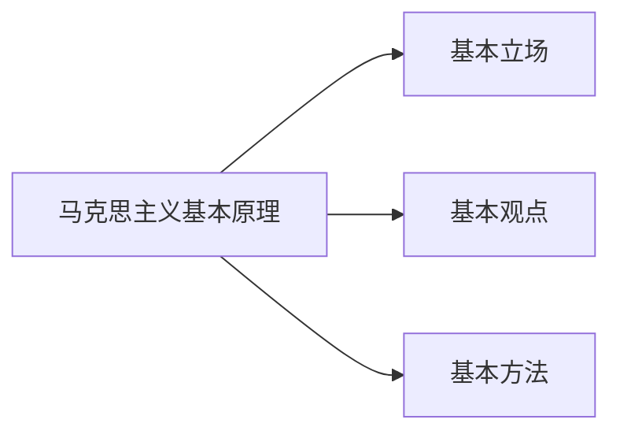

### 马克思主义基本立场

值得指出的是，几乎所有主张和主义都是有所指向的，意味着每一个观点和主义都是有服务的对象、有固有不变的立场、有所追求的利益。*比如，斯多葛主义的对象是所有人，希望所有人获得永恒的安宁并习得德行。*对马克思主义来说，这就是**为大多数人发声，以多数人的利益为核心。**落到中国的特色社会主义中，那便是**扶贫**，**共同富裕**。

### 马克思主义基本观点

总结地说，其包括了**自然、社会、人类思维**的发展的一般规律的科学认知（马克思主义世界观、方法论）。最耳熟能详的比如：物质决定意识；事物矛盾运动规律的问题；实践和认知的辩证关系等等。

### 马克思主义基本方法

这就是指导人们落实马克思理论于实践中的内容。

>### 资本主义国家和社会主义国家极大的区别在哪里？
>
>前者由资本控制政府，后者由政府控制资本。
>
>### 社会主义国家为何要使用公有制？
>
>我们考虑一个私有的资本。其不可避免地要寻求升值，则将作为生产资料投入生产过程中去。而当这样的私有资本想要获得作为参与生产过程的报酬时，不可避免的会有更多倾向于这一私有资本而非工人或是生产过程中的其他人。若试图强制地降低对私有资本的报酬，不可避免的导致其参与生产的积极性降低，而反过来人民却一直无法跨越贫富差距的鸿沟。如此以往，贫富差距只会将进一步扩大（我们注意贫富差距是相对差距）。马克思认为，要解决这个问题，只能从破除私有化的角度入手，将生产资料公有化。这也是为什么我们国家有国企存在的原因。

## 马克思主义的创立与发展

### 马克思和恩格斯生活的时代背景

1. 资本主义生产方式在西欧有相当的发展（并产生了激烈的社会矛盾）
2. 工业革命和科技进步大大提高了劳动生产率
3. 社会两极分化，工人极其贫困（生产社会化和生产资料私有化的矛盾）
4. 经常爆发周期性经济危机
5. *无产阶级在反抗资产阶级的过程中产生了理论指导的需求*

### 马克思主义的理论来源

1. 以黑格尔为代表的**德国古典哲学**==（直接理论来源）==
2. 以亚当·斯密为代表的**英国古典政治经济学**
3. 以圣西门、傅立叶、欧文为代表的**英法空想社会主义**

### 马克思主义的诞生

1848年，英国伦敦，《共产党宣言》的发表标志着马克思主义的诞生。

## 马克思主义的鲜明特征

概括地说，马克思主义的鲜明特征就是**科学性和革命性的统一**。革命性就是马克思主义人民性、实践性和发展性的**应有之义和必然特征**。

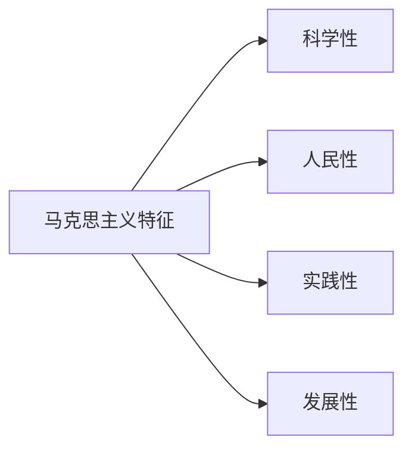

### 科学性

表现为拥有科学的世界观和方法论（历史唯物主义和辩证唯物主义）

这里我们区分一下自然科学的科学性和人文社科中的科学性。前者是指能被证实或证伪的不论对错的；后者是指正确的。

### 人民性

**人民至上**是马克思主义学说的基本立场。其学说的根本目的：**为人类求解放**。

### 实践性

从实践中来，到实践中去，在实践中经受检验，随实践不断发展。

### 发展性

能做到**与时俱进**。

## 马克思主义的当代价值

[0.3 马克思和他的学说（2）：世代传唱的“时代的歌中之歌”14'](https://www.icourse163.org/learn/WHU-1001717003?tid=1450264454#/learn/content?type=detail&id=1214541713)

[0.4 日出东方：马克思主义如何改变中国14'](https://www.icourse163.org/learn/WHU-1001717003?tid=1450264454#/learn/content?type=detail&id=1214541714)

[0.5 一个流行的问题：马克思主义在今天是否过时14'](https://www.icourse163.org/learn/WHU-1001717003?tid=1450264454#/learn/content?type=detail&id=1214541715&cid=1218328738&replay=true)

## 世界的物质性及发展规律

### 世界多样性与物质统一性

**世界观**是人们对整个世界的总体看法和根本观点。

**方法论**是人们认识和改造世界所遵循的根本方法的学说和理论体系。

**哲学**是系统化、理论化的世界观，也是方法论。因为有什么样的世界观，就有什么样的方法论。

> ### 什么是哲学的重大基本问题
>
> 从哲学的角度，所有事物都能归为两类：物质现象和精神现象。所以讨论存在和思维（又说物质和精神，客观和主观，物质和意识）的关系是较为重要的。其中关于物质和意识孰为本源的问题，称为**第一性问题**，形成了唯物主义和唯心主义这两个对立的学说；其中关于意识能否正确、彻底地反应或理解存在之物的问题，称为**统一性问题**，形成了可知论和不可知论。

在**古代朴素唯物主义**中，有两大理论我们可称之为巅峰，一则西方德谟克利特的原子论，二则中国的元气说。其最大的问题在于，其直观性、猜测性的特点，导致这样的理论不能被科学的证实。

在**近代形而上学**中，虽然理解了原子的存在，但是**不能正确理解哲学的物质概念和自然科学的物质概念之间共性和个性的关系**。

> ### 什么是形而上学
>
> #### 从学科的意义上来说
>
> 形而上学是指，理论的，抽象的意思
>
> #### 从哲学的意义上来说
>
> 形而上学指这样的认识世界的过程：分割整体并单独进行分析，但是**没有对世界的整体认知**

为了停止人们对**物质**从哪里来的无尽的追问（主要是说哲学意义上的而非自然科学意义上的），恩格斯做出这样的总结：“物、物质无非就是各种物的总和，而这个概念就是从这一总和中抽象出来的。”

20世纪，列宁重新定义物质的概念：

1. 是标志客观实在的哲学范畴
2. 人们通过感觉感知这样的客观实在（被人类意识反应）
3. 这样的客观实在不依赖我们而存在

在马克思主义中，物质只有一种特性被承认，==**客观实在性**==

****

既然对物质的概念些许明确的认识了，我们下面来讨论一下**物质存在的方式**。

马克思主义认为，物质的运动是**绝对的、无条件的**，而物质的静止（相对静止）则是相对的、有条件的。后者所指的具体有两种（静止的表现形式）：空间的相对位置暂时不变，或是说事物的根本性质暂时不变。

需要指出的是，**静止是运动的衡量尺度**，即我们用相对静止衡量绝对运动。

> 静止可以理解为事物的绝对运动要通过相对静止表现出来，并通过相对静止来衡量绝对运动的尺度。这里可以结合静止的定义来进行理解。静止有两种情况，一个是根本性质没有变化，一个是 相对于参照物而言空间位置没有变化。
>
> 如果离开相对静止来谈运动，运动也就无从获得自己的规定和衡量自己的尺度。任何事物相对静止的状况都是它过去的运动所造成的，并且是它将来运动的出发点。因为物质的多样性和事物的某种状态只有在相对静止中才体现出来。

同时考虑到物质是在时间和空间中存在的，我们对时间和空间进行考察。时间让物质运动有**持续性、顺序性、一维性**；空间让物质运动有**广延性、伸长性、三维性**。物质运动与时间和空间不可分割，说明了时空有==客观性==；具体的物质形态的时空是==有限性的==，整个物质世界是==无限性的==。

总结地说，**物质、运动、时间、空间**是有**内在统一性**的，意味着我们想问题、办事情的时候，都要考虑具体的时间、地点、条件。

****

接下来我们讨论一下**意识**的问题，以及马克思主义认为的其与**物质**的相关联性。

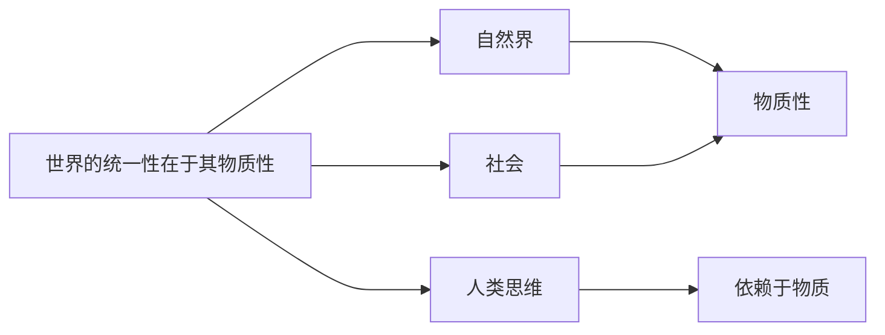

自然界和社会的部分我们都好理解（需要强调的是，将自然界和人类社会统一的现实基础是**实践**），所以接下来我们会重点考察**人类思维**为什么是有**依赖于物质**的特性。马克思主义认为：首先，本质上，**意识是人脑的机能和属性，是客观世界的主观映像**，意味着本质上人脑产生了意识（我们这里讨论的意识特指人类意识）。既然如此，意识，其**在内容上是客观的**，有现实物质基础可依据，是有客体原型、客观内容的（依据）；而其**在形式上是主观的**，是有主体差异和主观形式的（创造）。所以即使每个人对猫的所思所想不尽相同，但是都是基于客观存在的猫这样的生物而产生的。这样也不难理解人类思维为何依赖于物质，从而也说明了**世界的统一性在于其物质性**。

另一方面，从==意识的起源==来看：

1. 意识是**自然界长期发展的产物**（从低等动物的刺激感应性，到高等动物的感觉和心理，最后到人类的意识）
2. 意识也是**社会历史发展的产物**（社会实践，尤其是劳动，在意识到产生和发展中起到了决定性的作用）

> (1)意识是自然界长期发展的产物。意识现象既不是人脑主观自生的，也不是从来就有的，自然界先于意识而存在。意识是物质世界发展到一定阶段的产物。自然界的长期发展产生了人和人脑，为意识的形成提供了物质基础。
> (2)意识是人类社会发展的产物，语言和人脑的形成为意识的产生提供了条件，而社会性的劳动则最终促成了意识的形成。从这个意义上说，意识又是人类社会的产物。

但是我们又不得不承认，**意识对物质是有反作用的**。

1. 意识具有目的性和计划性
2. 意识具有创造性
3. 意识具有指导实践改造客观世界的作用
4. 意识具有调控人的行为和生理活动的作用

如此，我们需要理解**主观能动性和客观规律性是辩证统一**的。为何是统一的呢？因为**尊重客观规律是正确发挥主观能动性的前提**，而只有**发挥主观能动性，才能正确认识并利用客观规律**。那么如何正确发挥人的主观能动性呢？一则，**从实际出发**；二则，**认识到实践是正确发挥人主观能动性的根本途径**；三则，**发挥需要一定物质条件和手段**。

### 事物的普遍联系和变化发展（唯物辩证法）

这里，马克思主义提出了一个概念：**唯物辩证法**。我们可以拿形而上学和这个对比着来认识它。从哲学角度上来说，唯物辩证法是全面的观察世界的，而形而上学，相反的，是片面的、相孤立的观察世界的。所以，最重要的是，唯物辩证法认为：**万事万物都处在普遍联系之中，事物是`联系`、`发展`的**。==这便是唯物辩证法的总观点了。==（意味着唯物辩证法的总观点便是：普遍联系、永恒发展的两个观点）相对的，形而上学认为事物是静止的：比如微观经济学里的静态分析法。

下面我们挨个来看什么是`联系`,什么是`发展`。

****

什么是**联系**呢？联系是事物内部各要素之间和事物之间相互**影响**，相互**制约**，相互**作用**，产生变化和影响。

接下来我们来重点考察一下联系的**特征**，包括：**客观性、普遍性、多样性、==条件性==**。

#### 联系的客观性

首先，任何两个事物之间都是存在普遍联系的，换言之，**每一种事物都是在与其他事物的联系之中存在的**。而客观性就是指出我们必须从事物**本身固有的联系**出发去认识，而杜绝**主观臆断**的联系。后者就称之为主观辩证法了。

#### 联系的普遍性

这个普遍性有三层含义：

**第一层**，任何事物内部的要素是相互联系的；**第二层**，任何事物都不是孤立存在的，都是和其他事物处在一定的联系中的；**第三层**，整个世界是相互联系的、统一的整体。

#### 联系的多样性

事物间的联系是极为复杂、多种多样的。

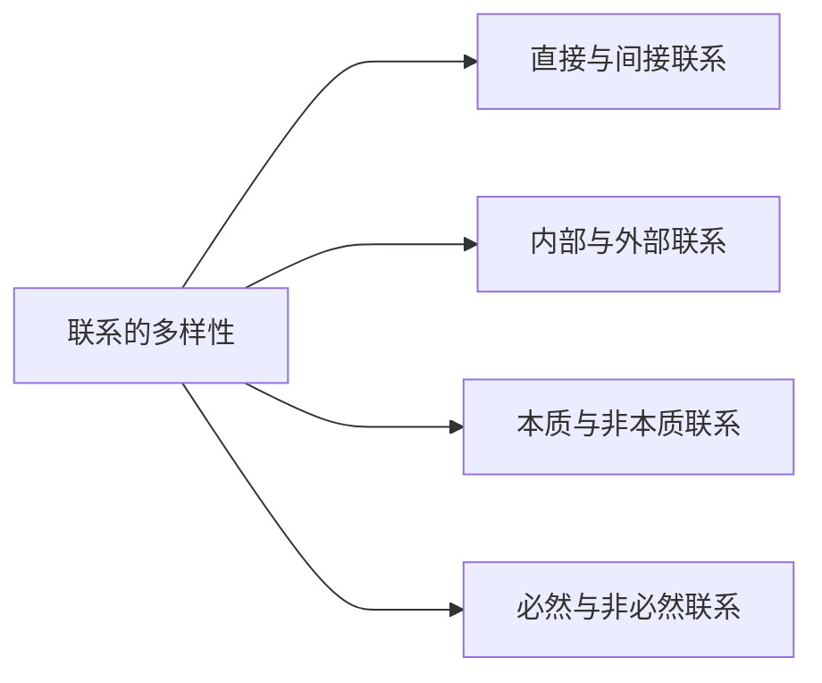

#### 联系的条件性

1. 条件对事物发展和人的活动有**支持或者制约**作用
2. 条件是可以被改变的
3. 改变、创造条件不是任意的，是要遵循事物一般发展规律的

同时值得注意的是，事物间是存在普遍联系没错，但是落实到具体的联系，不一定任意两个事物之间是有这一特别联系的，这样具体、特别的联系是有相对应的条件的。这就是为什么我们要改变或者创造条件，因为这样做能改变一些事物间的联系（发挥主观能动性）。

****

什么是事物的变化呢？

首先，事物是处在不断、永恒的**运动**中的，而运动带来的改变我们称为**变化**，如果指明事物的变化有一个趋势，尤其是是在前进、上升的，那就称为**发展**。

马克思主义的定义下，==**发展**==是**新事物的产生和旧事物的灭亡**。

新事物是：

1. 合乎历史前进方向
2. 有远大前途的事物

旧事物：

1. 丧失历史必然性
2. 日趋灭亡的事物

为何新事物不能战胜旧事物？

1. 新事物因其新要素、结构和功能，适应了已经变化了的环境和条件；旧事物则不能适应新的环境；
2. 新事物否定了旧事物中消极腐朽的部分，保留了合适积极的部分，并添加了旧事物不能容纳的新内容。

#### 对立统一规律是事物发展的根本规律

唯物辩证法揭示了事物变化发展的三个一般规律：对立统一规律、量变质变规律、否定之否定规律。其中，**对立统一规律**是根本规律，因为其余两个都是以此为基础建立起来的。同时，它说明了事物普遍联系的根本内容和变化发展的内在动力。

但首先，普遍意义上的，我们现厘清一些概念。马哲里的矛盾，说的是从事物关系的角度看的矛盾。其次，对立统一规律是说任何事物与其之外的其他事物，先是对立的，再是统一的，是事物间**联系**的具体延伸。对立和统一都是好找出来好看的，但是解决对立与统一如何实现转化是不太容易的。

##### 矛盾的同一性和斗争性

**矛盾**反映了事物内部以及事物间对立统一的状况。而其中**对立**和**统一**遍分别体现了矛盾的两种基本属性。前者又称斗争性，后者又称同一性。

矛盾的**同一性和斗争性性质**：

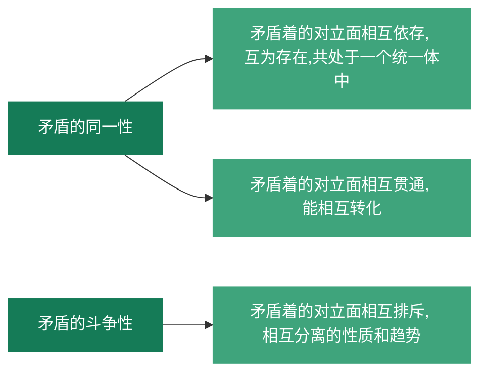

矛盾的**同一性和斗争性关系**：同一性和斗争性相互联结、相辅相成。同一性是相对的，有条件的，而斗争性是无条件的，绝对的。

矛盾的**同一性的作用**：

1. 同一性是事物存在和发展的前提，发展是在矛盾统一体中发展
2. 同一性让矛盾的双方相互戏曲有利的因素，在相互作用中各自得到发展
3. 同一性规定了矛盾相转化的可能和趋势

矛盾的**斗争性的作用**：

1. 矛盾双方的斗争导致力量的变化，致使双方力量发展不均衡，为矛盾转化创造条件
2. 斗争是一种矛盾统一体向另一矛盾统一体转化的决定性力量

##### 矛盾的普遍性和特殊性

我们先阐述比较重要的术语的内涵。

**普遍性**：矛盾存在于一切事物中，存在于一切事物发展过程的始终。

**特殊性**：各个事物、各个事物的不同发展阶段上，矛盾都有具体而不同的特征。

**主要矛盾和次要矛盾**：主要矛盾在矛盾体系中占据支配地位，对事物发展有决定性作用；次要矛盾则是处于从属地位、对事物发展有次要作用。

**主要方面和次要方面**：每个（对）矛盾中都有主要方面和次要方面。**事情的性质**是由矛盾的主要方面决定的。

所以简单地说，矛盾是有普遍性也有特殊性的。每个事物都有其主要矛盾和次要矛盾，每个矛盾都有其主要方面和次要方面。那么如何正确处理主要和次要矛盾、主要和次要方面的辩证关系呢？

**两点论和重点论**：

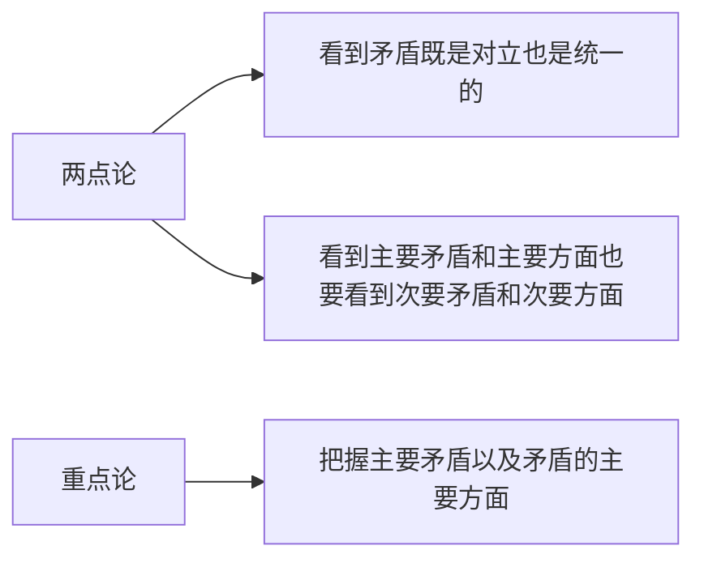

综上，在实际处理问题时，我们要坚持“两点论”和“重点论”的统一，全面看待问题，但又要把握住主流、大势、发展趋势。

矛盾的**普遍性和特殊性**的辩证统一关系：矛盾的普遍性是无条件的、绝对的；而矛盾的特殊性是有条件的、相对的。

#### 量变质变规律

**质**是事物区别于其他事物的内在规定性。

**量**是事物的规模、程度、速度等能够由数量关系描述的规定性。

**度**是保持事物的质的稳定的数量界限，或是是事物的限度、幅度和范围。**其两端**是关节点或说临界点。

可以看到的是，质和量的统一在度中得到体现。

**量变**保持了事物质的相对稳定性和不显著变化，体现事物发展的渐进过程的连续性；**质变**是事物根本属性的变化，是事物由一种质态向另一种质态的飞跃和跃迁，体现事物发展渐进过程的连续性的中断。

**量变和质变的辩证关系**是：

1. 量变是质变的必要准备
2. 质变是量变的必然结果，并为新的量变创造条件
3. 量变和质变是相互渗透的：量变的过程中有阶段性、局部性的质的变化；质变的过程中有旧质的量的收缩和新质的量的扩张。

#### 否定之否定规律

任何事物内部都存在肯定的方面和否定的方面，由于矛盾双方的相互作用，当否定的方面上升到支配地位之时，事物就会走向自身的否定，再由否定进一步走向更高阶段的肯定，即否定之否定。

**肯定因素**是维持现存事物存在的因素，而**否定因素**是促使现存事物灭亡的因素。在**唯物辩证法**中对否定有==深刻的内涵==：

1. 否定是事物的**自我否定**、自我发展，是事物矛盾运动的结果；
2. 否定是==**事物发展的环节**==，是==旧事物/旧质==向==新事物/新质==的飞跃；
3. 新旧事物是通过否定的环节**联系**在一起的（即，事物的否定是==**事物联系的环节**==）；
4. 辩证否定的实质是新事物对旧事物的既批判又集成。 

#### 联系和发展

唯物辩证法中有5个成对范畴，揭示了事物的联系和发展的基本环节。

##### 内容与形式

**内容**是构成事物的一切要素的总和，**形式**是把要素统一起来的结构或者表现内容的方式。内容对形式起到==决定作用==；而形式对内容有==反作用==：适合内容的形式对内容有推动作用，反之亦然。这说明内容具有==相对独立性==：同一内容可以通过不同形式来表现。

##### 本质与现象

**本质**是事物的根本性质，是事物的内在联系；**现象**是事物的外部联系和表面特征，是本质的外在体现。所以实际上，真象是从正面表现了本质的现象，相对应的假象是从反面歪曲表现了本质的现象。本质决定现象，现象表现本质。

##### 原因与结果

**原因**是引起某种现象的现象，**结果**是被引起的现象。值得注意的是：原因和结果是不能颠倒的，**原因在前，结果在后**；**原因和结果是相互依存和相互转化的**，没有无因之果，也没有无果之因，一种现象在一种联系中是因，在另一种现象中是果。

##### 必然与偶然

**必然**是事物的联系与发展中确定不移的趋势，**偶然**是事物的联系和发展中不确定的趋势。必然与偶然相互转化相互依存。

##### 现实与可能

**现实**指==相互联系的实际存在的事物的总和==，而**可能**指==包含在事物中、预示着事物发展前途的种种趋势==。现实与可能**相互区别**；现实与可能**相互转化**，而**发展**就是现实与可能相互转化的过程。

这就要求我们：

1. 立足现实，对可能作出分析与预判
2. 着眼长远，防止坏的可能变成现实
3. 创造条件，来实现好的可能

### 唯物辩证法是认识世界和改造世界的根本方法

#### 唯物辩证法的本质特征和认知功能

1. 本质上，唯物辩证法是**批判的**和**革命**的。因为其否认现存事物的永恒性、绝对性和神圣性。
2. 唯物辩证法是**客观辩证法**和**主观辩证法**的统一。前者是用物质世界本身的联系与发展分析，后者是以观念的、逻辑的形式分析
3. 唯物辩证法是**科学的**认识方法

#### 辩证思维方法与现代科学思维方法

##### 辩证思维方法

主要有4对范畴：**归纳与演绎**、**分析与综合**、**抽象与具体**、**逻辑与历史统一**。==这里不要和联系与发展的5对范畴混淆。==这里说的是辩证思维方法的具现，而联系与发展的5对范畴是**事物联系与发展的基本环节**。

****

###### 归纳与演绎

**归纳**是从特殊到一般，**演绎**是从一般到特殊。

****

###### 分析与综合

**分析**是形而上学的、分而析之的，是在思维中把认知对象分解为各个部分、方面、要素，并加以研究。

**综合**是将各个因素组合成整体的思维活动。

****

###### 抽象与具体

简单来说这一辩证思维的**高级形式**经历了这样的过程：从感性的具体到抽象，再从抽象到思维的具体。==感性的具体到抽象==是从人的器官所得到的具体的感知表象中抽离出必然的、本质的方面因素；==从抽象到思维的具体==就是把事物的各方面的本质认识联系起来。

****

###### 逻辑与历史统一

历史从哪里开始，思想进程就应当从哪里开始，分析的逻辑起点也从哪里开始。思想进程的进一步发展不过是历史过程在抽象的、理论上前后一贯的形式上的反馈。

#### 学习唯物辩证法

包括提高：**辩证思维能力**、**历史思维能力**、**系统思维能力**、**战略思维能力**、**底线思维能力**和**创新思维能力**。  

## 实践与认识

### 科学实践观

#### 科学实践观的发展

**过去的、不太行对实践的理解**belike：

1. 中国哲学中指道德伦理行为
2. 康德认为是理性先天的道德活动
3. 黑格尔认为是主体自我实现的精神活动
4. 费尔巴哈认识的实践仅限于日常生活活动

**马克思的理解**：

1. 在**《关于费尔巴哈的提纲》**中，他系统性的揭示了实践的观点。他强调==全部社会活动本质上都是实践的==，而事物的正确错误与否，都在于人的实践。
2. 在**《德意志意识形态》**中，他进一步指出：==物质资料的生产是人类历史中首要的社会实践活动==。

**之后的发展**：

1. 列宁，《唯物主义与经验批判主义》
2. 毛泽东，《实践论》
3. 邓小平，支持真理标准问题大讨论、强调实践是检验真理的唯一标准
4. 习近平

### 实践

#### 实践的基本内涵

**实践**的定义是：==人类能动地改造世界的社会性的物质活动==。（是人类特有的活动）

==**&&实践**的特性是：客观实在性；自觉能动性；社会历史性。==

#### 实践的基本结构

实践活动的三项基本要素：**主体、客体、中介**。

**实践主体**：实践主体是指==具有一定的主体能力，从事现实社会实践活动的人==；
**实践客体**：指实践活动所指向的客观存在的对象，可以从`是否被实践创造`，`自然与人类社会`，`物质性与精神性`角度考察；认识的客体是主体实践和认识的对象 ；
**实践中介**：指==各种形式的工具、手段以及运用它们的程序和方法==。

值得指出的是，实践的主体与客体相互作用的关系，包括：**实践关系、认知关系、价值关系**。`实践关系`是==**首要的**==，是主客体间的相互改造；`认识关系`便是主客体认识与被认识的关系；`价值关系`基于主体的目标和利益诉求，是为了满足自己的需要而产生的。

#### 实践的基本结构变化

实践的基本结构变化主要表现为**主体客体化**和**客体主体化**的双向运动。

**主体客体化**：人通过实践使自己的本质力量作用于客体，使其按照主体的需要发生结构和功能上的变化，形成世界上本不存在的对象物，是人的体力和智力的物化体现。==实际上，人的一切实践活动都是主体客体化的结果。==

**客体主体化**：客体从客观对象的存在形式转化为主体生命结构的因素或主体本质力量的因素。（i.e. 电脑、汽车等）

#### 实践形式的多样性

基本可以分成：==**物质生产实践、社会政治实践、科学文化实践**==。

#### 实践对认知的决定作用

在实践和认知之间，实践是认识的基础，实践在认知活动中起着决定性的作用。

> 1. 实践是认知的来源
> 2. 实践是认识发展的动力
> 3. 实践是认识的目的
> 4. 实践是检验认知真理性的唯一标准

### 认识的本质与过程

`唯物主义`坚持**反映论**的立场，认为**认知是主体对客体的反映**；`唯心主义`认为**认知先于人的实践经验**，其中`主观唯心主义`认为人的认知是主观自生的，而`客观唯心主义`认为人的认识是上帝的启示或是某种客观精神的产物。

`旧唯物主义`把人的认知看成是消极地、被动地反映和接受外界对象，一则离开实践考察认知问题，二则是不了解认知的辩证本性。

`辩证唯物主义`是建立在实践基础上的能动的反映论，坚持==实践是人类能动地改造世界的社会性的物质活动==。其从==主观与客观的关系中把握人的活动==。其余的皆是脱离实践谈认知，脱离联系，脱离唯物辩证法。==认识对实践有能动作用，实践队认知有决定作用。==

认识的根本任务就是经过感性认识上升到理性认识,透过现象抓住事物的本质和规律；而认识的根本目的则是**把理性认识应用于实践,去指导实践,改造世界**.

### 辩证唯物主义认知论的特点

有两大重要特点：

1. 把实践的观点引入认知论
2. 把辩证法应用于反映论考察认知的发展过程

#### &&从实践到认知

`感性认知`是认知的初级阶段，其用**具体的、生动的形象直接反映外部世界**，没有深入到对事物本质的理解，所以感性认知具有不深刻的局限性，必须进一步上升到理性认知。
包括**感觉**、**知觉**和**表象**三种形式。**感觉**是人的感觉器官对客观事物的个别属性、个别方面的直接反映，是起始环节；**知觉**是人的感觉器官对客观事物外部特征的整体反映；**表象**则是感性认识的高级形式，*是人脑对过去的感觉和知觉的回忆*，是曾经作用于感觉器官的客观对象的形象体现。

`理性认知`包括：**概念、判断、推理**。`概念`是对同类事物共同的一般特性和本质属性的概括和反映。`判断`是对事物间的联系和关系的反映，判断事物是什么不是什么，是否具有某种属性。`推理`表现为判断与判断之间的关系，由已知合乎逻辑地推出未知的反映形式。

感性认知与理性认知的关系是辩证统一的：

1. 理性认知有赖于感性认知
2. 感性认知需要发展和深化为理性认知
3. 感性认知与理性认知相互渗透、相互包含

割裂两者的辩证关系，则要么走向轻视感性认知而夸大理性认知的唯理论、犯教条主义的错误，要么轻视理性认知而夸大感性认知，走向经验论而犯经验主义的错误。

#### 从认知到实践

从认知到实践的重要性和必要性在于：

1. 认知世界的目的在于改造世界（认识的第二次飞跃）
2. 认知的真理性只有在实践中才能得到检验和发展

## 真理与价值

### 真理的客观性、绝对性和相对性

真理是标志主观与客观相符合的哲学范畴。

#### 客观性

对客观事物及其规律的正确反映，包含着不依赖于人和人的意识的客观内容。

其决定真理有`一元性`，意味着在同一条件下，对特定的认知客体的真理性认知**有且只有一个**。认识是多元的，而真理是一元的。

实用主义断言“有用即真理”，实际上有用的不一定都是真理。有用的判断是与主体紧密相关的，从根本上会否认客观真理的存在。

#### 绝对性与相对性的统一

首先，真理的`绝对性`指真理==主客观统一的确定性==和==发展的无限性==。下面阐述一下这两个方面的内涵：

1. 任何真理都标志着不依赖于人和人的意识的客观内容，都同谬误**有着原则性的界限**；
2. 人类能正确认识无限发展着的物质世界，故而真理也是在**无限发展**着的。

其次，真理的`相对性`是说人们**在一定条件下**对客观事物及其本质的发展规律的正确认知总是==有限度的、不完善的==。

1. 从客观世界的整体来看，任何真理都是对客观世界的某一阶段、某一部分的正确认识，人类在**广度上**总是有限的；
2. 从反映事物的**深浅上**看，任何真理都是对客观对象的**一定方面、一定层次、一定程度**的正确认知

----

下面我们来讨论一下真理的绝对性和相对性的辩证统一关系。

**从真理的两重性上**来看，真理的绝对性和相对性相互依存。绝对性对相对性的依赖在于==真理总是从相对性逐渐发展为绝对性==；相对性对绝对性的依赖在于==相对的真理总有发展成为绝对真理的方向与趋势==。

**从真理的发展上**来看，人类的认知是不断深化的过程，始终处在由真理的相对性走向绝对性的发展过程中。

割裂真理的绝对性和相对性会走向形而上学的真理观，**绝对主义**和**相对主义**。

#### 真理与谬误

**谬误**是同客观事物及其发展规律相违背的认知，是对客观事物及其发展规律的歪曲反映。

而真理与谬误的关系是既对立又统一。

为何真理与谬误相互对立？在**确定的对象和范围内**，真理与谬误的对立是绝对的，与对象相符合的认知是真理，与对象相违背的认知是谬误。

为何真理与谬误相互统一？在**超过非常有限的范围**后，真理与谬误的对立便是相对的。因为：

1. 真理是具体的，超过某个一定范围、失去一定特殊条件，真理就变成了谬误；
2. 真理是全面的，而将其从科学体系中孤立地抽取出来、切断同其他原理的联系，则会使之丧失自己的真理性而变成谬误。

### 真理的检验标准

在真理的检验中，我们强调客观性。过往的哲学很多都**以认知检验认知，以虚验虚，不能了解到想要检验的究竟是否是真理**。

---

==**实践是检验真理的唯一标准**。==这是由真理的本性和实践的特点决定的。

第一，由于真理是人们对客观事物及其发展规律的正确反映，是主客观相符。那么，**检验真理就是检验人的主观认识同客观实际是否相符合以及符合的程度**。

第二，实践是具有**直接现实性**的，意味着其有客观实在性的具体表现。实践能把理论、认知变成实在的现实，把主观的变成客观的。

---

==**实践作为检验真理的标准，是确定性与不确定性的统一。**==

首先，实践的确定性是指**实践作为检验真理标准的唯一性、归根到底性、最终性**，这样的特性是由其实践标准的客观性和唯一性决定的。

其次，实践的不确定性/相对性是指**实践作为检验真理标准的条件性**。一方面，实践会受到主客体条件的制约；另一方面，实践是社会的、历史的实践，有**局限性、相对性**。

需要强调的是，实践对真理的检验不可能一次完成。

### 真理与价值的辩证统一

#### 价值

价值是指在实践基础上形成的主体与客体之间的意义关系，是客体对**个人、群体乃至整个社会**的生活和活动所具有的积极意义。其==标准==是主观的，代表了客体对主体的利益。主体不同，利益不同，相同客体的价值不同。

价值既具有主体性特征，也具有客观基础。因为价值体现在主体和客体的关系中，是人与满足其某种需要的客体之间的意义关系。

#### &&价值的基本特性

价值具有==四个基本特性==：`主体性`、`客观性`、`多维性`、`社会历史性`。

第一，价值的主体性。意味着价值直接与主体相关联，以主体为中心。这是由于：

1. 价值关系的形成依赖于主体的存在；
2. 价值关系的形成依赖于主体的创造。

第二，价值的客观性，意味着在一定条件下客体对主体的意义不依赖于主体的主观意识而存在。**价值的主体性是以其客观性为前提的**。这是由于：

1. 主体的存在和需要是客观的；
2. 客体的存在、属性及作用是客观的。

第三，价值的**多维性**，指每个主体的价值关系会因对客体的不同需要而有不同的价值。

第四，价值的社会历史性。这是由于价值关系中，主体是在一定社会关系中从事实践的具体的人，而随着实践和历史的发展，主体和客体以及主体客体之间的关系发生变化，导致人们对客体价值的判断也发生改变。

### 价值评价及其特点

价值评价，也是评价性认知或价值判断，是主体对客体的价值以及价值大小所做的评判或判断，是对客观价值关系的主观反映。

其特点有：

1. 评价以主客体的价值关系为认知对象；
2. 评价结果与评价主体直接相关；
3. 评价结果的正确与否依赖于对客体状况和主体需要的认知。

### 真理与价值在实践中的辩证统一

**人们的实践活动总是受到真理尺度和价值尺度的制约**。`实践的真理尺度`是说实践中人们必须遵从正确反映客观事物本质和规律的真理；`实践的价值尺度`是指实践中人们都是按照自己的尺度和需要去认识世界和改造世界。

其辩证统一的关系体现在：

1. 价值尺度必须以真理为前提；
2. 人类自身需要的内在尺度（为了实现更美好的生活），推动着人们不断发现新的真理

同时，需要指出的是，基于实践的具体性和历史性，真理尺度和价值尺度的统一是==具体的、历史的==。

其关系体现在：

1. 真理原则侧重于客观性，价值原则侧重于主体性
2. 追求真理和创造价值是人类活动的两大主题
3. 真理和价值的矛盾是人类活动的内在矛盾
4. 实践是真理和价值共同的检验标准
5. 真理与价值在发展中相互引导

## 认识世界和改造世界

### 认识世界和改造世界的过程是从必然走向自由的过程

首先，什么是自由？马克思主义认为，**自由是表示人的活动状态的范畴**，是指人在活动中通过认知和利用必然所表现出的一种自觉自主的状态。人不能摆脱必然性的制约，也只能在认识必然性的基础上才有自由的活动。这其中，必然性即规律性，指==不依赖于人的意识而存在的自然和社会发展所固有的客观规律==。

自由有两大条件：认识条件和实践条件。前者指**对客观事物运动发展规律性、必然性的正确认识**；后者指讲获得的规律性认知运用于指导实践，实现改造世界的目的。

# 人类社会及其发展规律

## 人类社会的存在与发展

### 社会存在和社会意识

#### 社会存在

> 唯物史观认为，社会存在决定社会意识；唯心史观认为，社会意识决定社会存在。

`社会存在`是指社会物质生活条件，是社会生活的物质方面，主要包括：**自然地理环境、人口因素和物质生产方式**。

**自然地理环境**是人类社会所处的地理位置相联系的自然条件的总和，是==人类社会生存和发展永恒的、必要的条件==。其优劣对劳动生产率的提高产生或积极或消极的影响，对社会进步有或促进或延缓的作用。

**人口因素**是包含人口数量、质量、构成、分布、迁移、自然变动和社会变动等的综合范畴。

**物质生产方式**通常简称生活方式，是人们为获取物质生活资料而进行的生产活动方式，==是生产力与生产关系的统一体==。这是人类一切其他活动的首要前提，也决定着社会的结果、性质和面貌。

#### 社会意识

`社会意识`是**社会存在的反映**，是**社会生活的精神方面**。

根据不同主体，可以分为**个体意识**和**群体意识**；
根据不同层次，可以分为`社会心理`和`社会意识形式`。前者是==自发的、不系统的、不定型的感知、情绪、心态、习俗等感性认知==，后者是==自我感知的、系统的、相对稳定的政治法律、道德、艺术、宗教、哲学、**科学**等理性认知==。

社会意识是`具体的`，`历史的`，`相对独立的`。前两个指出其对社会存在的依赖性，后一个指出其同时还有自身特有的发展形势和发展规律（对社会存在有能动的反作用）。

#### 社会存在和社会意识的辩证关系

社会存在是社会意识内容的**客观来源**，社会意识是社会物质生活过程及其条件的**主观反映**。社会意识对社会存在有能动的反作用，在一定条件下会转化为物质力量并作用于社会存在，影响历史的发展。

### 社会基本矛盾及其运动规律

#### 生产力与生产关系的矛盾运动及其规律

##### 生产力

`生产力`是人类在生产实践中形成的改造和影响自然以使其适合社会需要的**物质力量**。其**重要因素**是科学技术，是第一生产力。反映了==人类社会和自然界的关系==。衡量生产力水平的客观尺度是==劳动资料特别是生产工具的发展水平==。其特征是==客观现实性、社会性、历史性==。

> **值得注意的是，科学技术不是一切社会变革中的自主性力量**
>
> 科学技术在社会变革中起着重要的作用，**但不是唯一的自主性力量**。社会变革是多重因素共同作用的结果，包括经济制度、政治制度、文化传统、社会心理等因素。科学技术是其中的一个重要因素，它通过提高生产力、改变生活方式、影响人们的思想观念等方式对社会变革产生影响。但是，社会变革不是仅仅由科学技术决定的，而是多种因素共同作用的结果。因此，科学技术不是一切社会变革中的唯一自主性力量。

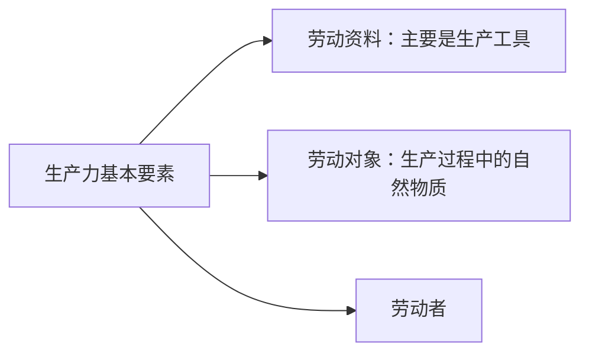

##### 生产关系

`生产关系`是人民在物质生产过程中形成的不以人的意志为转移的**经济关系**，进而影响其他社会关系（政治关系、家庭关系、宗教关系等）。`生产资料所有制关系`是最基本的，因为这决定了人民进行物质资料的**生产、分配、交换和消费关系**。其能区分不同的生产方式，是判定**社会经济结构性质的**客观依据。

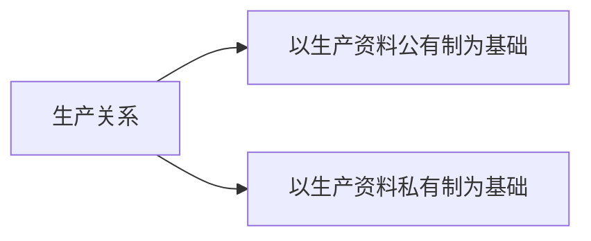

##### 生产力和生产关系的相互关系

==**生产力决定生产关系，生产关系反作用于生产力。**==生产关系必须要适合生产力的状况。

首先，关于`生产力决定生产关系`。

1. **生产力状况决定生产关系的性质**，是生产关系形成的客观前提和物质基础；
2. 生产力的发展决定生产关系的变化，当生产关系不能适应生产力发展的要求时，人民就会建立起新的生产关系，**但注意这并不是生产力决定论**。

其次，关于`生产关系反作用于生产力`

1. 当生产关系适合生产力的时候，对生产力的发展起**推动作用**；
2. 当生产关系不时候生产力的时候，对生产力的发展起**阻碍作用**。

#### 经济基础与上层建筑的矛盾运动及其规律

`经济基础`是由社会发展到一定阶段的生产力所决定的生产关系的总和。需要指出的是，首先，这里的生产关系是指所存在的多种生产关系中占据支配地位的那种；其次，经济体制是生产关系的具体体现形式，与生产力发展的关系更加直接具体。（不同人、不同群体所占有的财富总和）

`上层建筑`是指**在一定经济基础上的意识形态和与之相适应的制度、组织和设施**，由`意识形态`和`政治法律制度及设施和政治组织`两部分组成。`意识形态`是指**观念上层建筑**，包括==政治法律思想、道德、艺术、宗教、哲学==；`政治法律制度及设施和政治组织`指**政治上层建筑**，包括==政党、国家政治制度、立法司法制度、行政制度、军队==等。（源于对利益保障的需求）**政治上层建筑**居于主导地位，==国家政权是政治上层建筑的核心==。

需要指出的是，`国家`是阶级矛盾不可调和的产物，是**经济上占支配地位的阶级为维护其根本利益而建立起来的强制性暴力机关**。`国体`是社会各阶级在国家中的地位，表明国家政权掌握在哪个阶级手中，谁统治谁；`政体`是指统治阶级实现其阶级统治的**具体组织形式**。

经济基础与上层建筑是辩证统一的。**首先，经济基础决定上层建筑**：经济基础是上层建筑产生、存在和发展的物质基础；**其次，上层建筑对经济基础有反作用**：为自己的经济基础的形成和巩固提供服务，当其为社会生产力发展要求的经济基础服务时，能推动社会发展的进步，而反之则阻碍。

最后，==**上层建筑一定要适合经济基础状况**==。

### 人类普遍交往与世界历史的形成发展

`交往`是重要的唯物史观范畴，指**在一定历史条件下的现实的个人、群体、阶级、民族、国家在==物质和精神==上的相互往来、作用和联系的活动**。其可以被划分为`物质交往`和`精神交往`。

交往是人类实践活动的重要组成部分，对社会生活有重要影响：

1. 促进生产力的发展
2. 促进社会关系的进步
3. 促进文化的发展与传播
4. 促进人的全面发展

---

唯物史观中，`世界历史`是各民族、国家通过普遍交往，进入相互依存、相互联系的世界整体化的历史。世界历史的形成促进了**生产力的普遍发展**和**人类的普遍交往**，推动社会发展，为人的发展创造了条件。

==**普遍交往是世界历史的基本特征**==

### 社会形态更替的一般规律及特殊形式

==`社会形态`是（同生产力发展到一定阶段）相适应的`经济基础`和`上层建筑`的统一体。==**i.e. **原始社会、奴隶社会、封建社会、资本主义社会、共产主义社会。这表明了社会形态是有`统一性`和`多样性`的。

---

社会形态的更替是有统一性和多样性的，这源于**社会发展的客观必然性**和**人们的历史选择性**。

`客观必然性`是指社会形态依次更替的过程和规律是客观的，其发展的基本趋势是确定不移的。这样的客观性来源于所有的社会关系都能归结于生产关系，而生产关系能归结于生产力。

`历史选择性`指出社会形态的更替规律也受到人们历史活动的能动性影响，主要体现在：

1. 客观必然性为人们创造了一定历史阶段社会发展的基本趋势，为人们后续的历史选择提供基础、范围和可能空间；
2. 社会形态的更替过程是主观能动性和客观规律性相统一的过程；
3. 人民的历史选择最终归根到底是人民群众的选择性，是符合根本利益、根本意愿的

---

社会形态的更替还表现为历史的`前进性与曲折性`以及`顺序性和跨越性`的统一。社会形态的更替本质上是“扬弃”的过程。

总结一下，社会形态更替的性质是：

1. 统一性与多样性统一
2. 客观必然性和历史选择性统一
3. 前进性与曲折性统一

## 社会历史发展的动力

### 社会基本矛盾在历史发展中的作用

#### 生产力和生产关系、经济基础和上层建筑的矛盾是社会基本矛盾

生产力与生产关系、经济基础与上层建筑的矛盾是**社会基本矛盾**：

1. 贯穿人类社会发展过程的始终；
2. 规定了社会发展过程中**各种社会形态、社会制度的基本性质**；
3. 制约社会其他矛盾的存在和发展，推动社会发展。

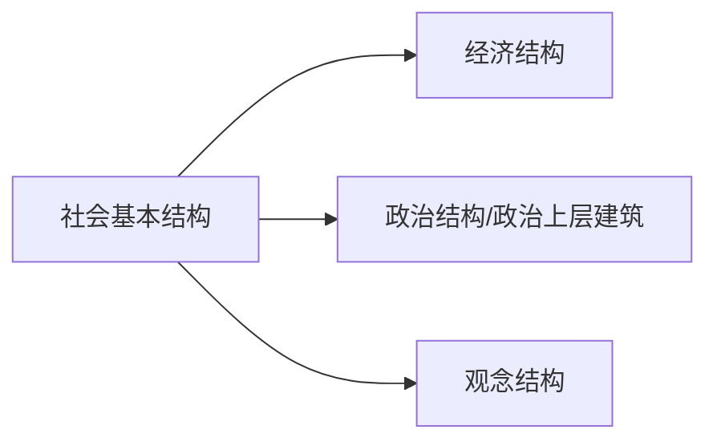

#### 社会基本矛盾是历史发展的根本动力

1. 生产力是社会基本矛盾运动中最基本的动力因素；
2. 生产力决定生产关系的性质，进而决定其他社会关系的基本面貌，决定世界发展的历史进程；
3. 生产力是社会进步的根本内容，是衡量社会进步的根本尺度；
4. 社会两个基本矛盾（尤其是生产力与生产关系这对矛盾）决定着社会中其他矛盾的存在和发展；
5. 生产力和生产关系是最为基本的矛盾，它们决定经济基础和上层建筑的矛盾的产生与发展；
6. 经济基础与上层建筑的矛盾影响并制约生产力和生产关系的矛盾。

### 阶级斗争和社会革命在阶级社会发展中的作用

#### 阶级和阶级斗争是人类社会发展到一定阶段才会出现的社会现象

阶级斗争是阶级利益根本冲突的对抗阶级之间的对立和斗争，源于**阶级之间物质利益的根本对立和社会经济关系的冲突**。

#### 阶级斗争是阶级社会发展的直接动力

在阶级社会中，生产力与生产关系的矛盾、经济基础与上层建筑的矛盾是**通过阶级斗争表现出来的**。所以强调一下，阶级斗争是阶级社会发展的==**直接动力**==，根本动力仍然是==**两个社会基本矛盾的运动**==。

阶级斗争**对阶级社会发展的推动作用**突出地表现在**社会形态的更替**中。

#### 马克思主义的阶级分析方法是认知阶级社会的科学方法

总而言之，个人与个人的利益不一致，群体与群体的利益不一致。

#### 社会革命的实质和作用

`广义的社会革命`是指社会基本矛盾运动基础上的**社会生活的全面变革**（包括人与自然的关系，人与人的社会关系、思维方式、思想观念的变革）；`狭义的社会变革	`是社会形态的变更，即**新的社会形态取缔旧的**。

==社会革命既是社会基本矛盾运动的结果，也是推动社会发展特别是社会形态更替的重要动力。==

社会革命爆发的**原因**在于==生产力的发展和旧的生产关系、经济基础的发展和旧的上层建筑之间出现矛盾==。

> 革命对社会发展起巨大作用：
>
> 1. 社会革命是实现社会形态更替的重要手段和决定性环节
> 2. 社会革命能充分发挥人民群众创造历史的积极性和伟大作用
> 3. 社会革命能极大教育和锻炼包括革命阶级在内的广大人民群众
> 4. 无产阶级革命将为消除阶级对抗，并充分利用全人类的文明成果促进社会全面进步创造条件

### 改革在社会发展中的作用

==它是一定程度上解决社会基本矛盾、促进生产力发展、推动社会进步的有效途径和手段。==

## 人民群众在历史发展中的作用

### 人民群众是历史的创造者

这意在强调**人民群众的重要性**。

人是一切社会关系的总和，其本质属性是社会属性；人的本质是变化、发展的。

> #### 唯物史观在考察谁是历史的创造者时坚持了如下的原则
>
> 1. 立足于现实的人及其本质来把握历史的创造者
> 2. 立足于整体的社会历史过程来探究谁是历史的创造者
> 3. 从社会历史发展的必然性入手考察和说明谁是历史的创造者
> 4. 从人与历史关系的不同层次上考察谁是历史的创造者（人类与历史、群体与历史、个人与历史）

### 人民群众在创造历史过程中的决定作用

1. 从质上看，人民群众是一切对社会历史发展起推动作用的人
2. 从量上看，人民群众是社会人口中的绝大多数
3. 不同历史时期，人民群众包括了不同的阶级、阶层和集团，但最稳定的仍然是始终从事物质资料生产的劳动群众

人民群众创造历史的活动会受到社会历史条件的影响，包括：**经济条件、政治条件和精神文化条件**等。

### 无产阶级政党的群众路线

==**一切为了群众，一切依靠群众**==。但也要认识到，**人民群众也是要被教育的**。

主要的内容包括：

1. 坚信人民群众自己解放自己的观点
2. 全心全意为人民服务
3. 一切向人民群众负责
4. 虚心向群众学习

---

==**同时我们也不否认个人在历史上的作用**==。

# 资本主义的本质及规律

## 商品经济和价值规律

### 商品经济的形成和发展

`自然经济`指生产是**为了直接满足生产者个人或者经济单位的需要，出于==追求使用价值==的经济形式**，不是为了交换。

`商品经济`则是**以交换为目的的**经济形式。其产生的条件包括：

1. 存在社会分工；
2. ==生产资料和劳动产品属于不同的所有者==

**条件一：**所谓社会分工，是*社会劳动划分和独立化为不同部门和行业*，各行各业的生产者就需要取得对方生产的产品来作为**生产资料**或是**消费资料**，因而产生了相互交换产品的需求。
**条件二：**生产资料和劳动产品属于不同的所有者，要想获得别人的东西，就只能通过**商品的形式**进行交换。

下面我们来阐述***商品***的特性。

商品是用来**交换**、能满足人的某种需要的**劳动产品（包括物质产品和劳动服务）**，具有`使用价值（感性的）`和`价值（生命的耗费）`两个属性，是这两属性的矛盾统一体。

`使用价值`是*商品能满足人的某种需要的有用性*，是**商品的自然属性**，这样的特性是*通过交换用来满足别人和社会的而非满足生产者自身需要的*。==**使用价值是交换价值的物质承担者**==。

`价值`是凝结在商品中的**无差别**的一般人类劳动（脑力和体力的耗费），能==**决定商品交换的比例**==，因为在质上做了统一故而能落到量上的比较。价值是**商品的社会属性**，任何有用之物都用使用价值，而仅当这种有用之物是**劳动产品**并作为商品的时候才有==**价值**==。

==**商品的使用价值和价值是对立统一的**==。为何对立？要获得商品的价值，就会放弃使用价值；要获得商品的使用价值，就不会得到价值。为何统一？没有使用价值的事物即使人们付出大量劳动事物也不会有价值；相反，像阳光和空气等不是劳动产品等物品尽管有使用价值，但也不能作为商品。

==生产商品的劳动有**二重性**，即**具体劳动**和**抽象劳动**。==**具体劳动**反映**人与自然的关系**，是**劳动的自然属性**；**抽象劳动**反映**商品生产者的社会关系**，是**劳动的社会属性**。==**这对对立统一的劳动是理解马克思主义政治经济学的枢纽**==。

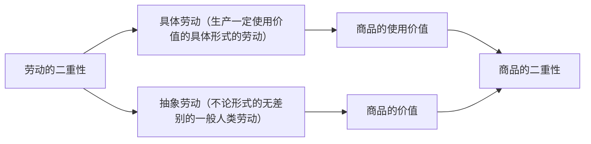

==**马克思的劳动价值论**为揭示资本主义生产方式的本质奠定了理论基础==。

==**劳动二因素**决定**商品二因素**==

---

下面我们对商品的价值做进一步的说明。

==商品的价值是凝结在商品中的**无差别的一般人类劳动**，价值量是由劳动者生产商品所耗费的劳动量决定的，而劳动量**按照劳动时间来计量**。==

生产商品的`社会必要劳动时间`会随着`劳动生产率`的变化而变化。==劳动生产率指劳动者生产使用价值的效率。==可以通过这两个方式来测量：

1. 单位劳动时间内生产的商品数量；
2. 单位商品中耗费的劳动时间；

影响劳动生产率的因素有：

1. 劳动者的平均熟练度
2. 科学技术的发展水平和在生产中的应用程度
3. 生产过程的社会结合
4. 生产资料的效能和规模（要素禀赋）
5. 自然条件

**复杂劳动等于自乘的或多倍的简单劳动**。这是由于==当复杂劳动生产出来的商品和简单劳动生产出来的商品相交换的时候，商品的价值是通过简单劳动衡量的。==

---

商品的价值形式经历了这四个阶段：

* **货币形式**是指一般等价物固定在黄金或白银上，一切商品的价值都通过金或银来表示

货币的职能有五种：

1. 价值尺度
2. 流通手段（一手交钱、一手交货）
3. 储藏手段
4. 支付手段（使用价值或商品使用权的让渡与价值的让渡在时间上是分开的——或延期支付，或提前预支）
5. 世界货币

其中`价值尺度`和`流通手段`是最重要的最基本的两个。

> #### 货币为何能执行价值尺度的职能？
>
> 货币之所以能够充当价值尺度，是因为它本身也是商品，具有价值。货币作为一般等价物，是一种特殊的商品。

### 价值规律及其作用

价值规律是关于商品生产和商品交换的基本规律：

> `商品的价值量`是由生产商品的社会必要劳动时间决定，`商品交换`以价值量为基础，按照**等价交换的原则**进行。**在商品经济中，价值规律的表现形式是，商品的价格围绕商品的价值自发波动**，然而其价格长期来看平均地与价值一致。

其在市场配置资源过程的作用和消极后果是：

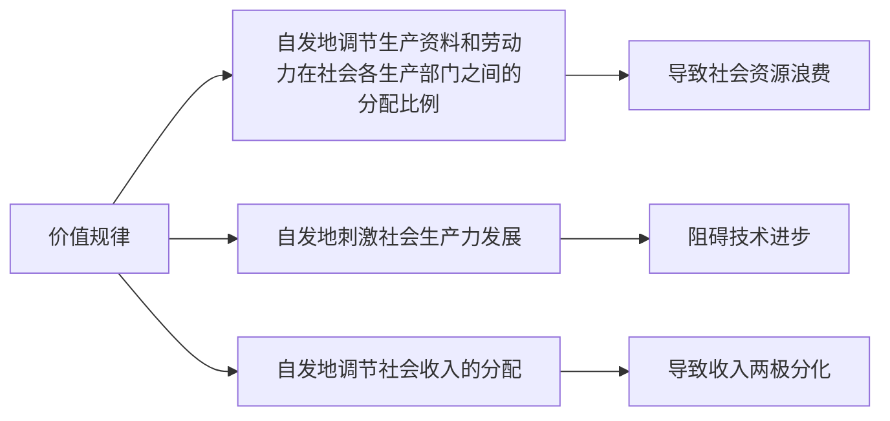

### 以私有制为基础的商品经济的基本矛盾

==私人劳动和社会劳动的矛盾==是商品经济的**基本矛盾**，这是由于商品使用价值和价值的矛盾以及生产商品的具体劳动和抽象劳动的矛盾。

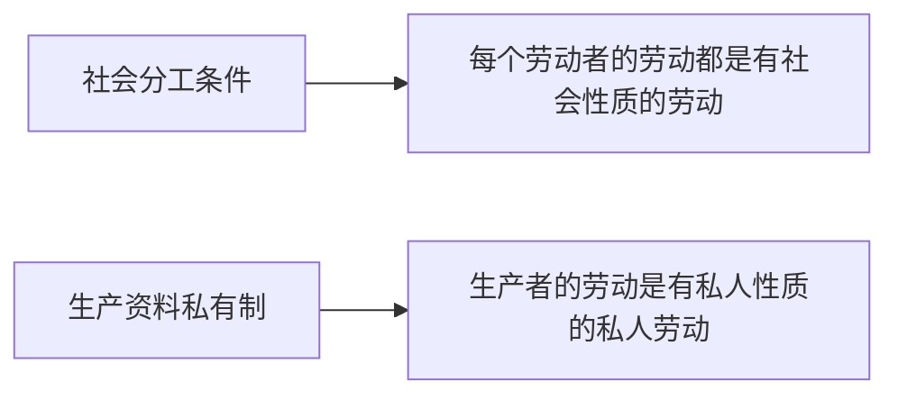

1. 私人劳动和社会劳动的矛盾决定着商品经济的本质及发展过程
2. 这对矛盾是商品经济其他一切矛盾的基础
3. 这对矛盾决定着商品生产者的命运

## 资本主义经济制度的本质

资本原始积累的两个方法：

1. 用暴力手段剥夺农民的土地
2. 用国家政权的力量进行残酷的殖民掠夺

---

资本表现为一定量的货币，而货币不是天然就是资本：

**商品流通的公式**：
$$
W —— G ——W
$$
这表明，商品流通的目的在于**获取使用价值**，同时交换领域中没有创造新价值。

**资本流通的公式**：
$$
G——W——G'
$$
这指出资本运动的目的一般在于资本增值，同时指出资本在流通中创造了新的价值。（实际上并不是流通的过程为资本创造了新价值，但是是通过这一过程实现增值的）

劳动力的价值在于：

1. 维持劳动者本人生存必须的生活资料的价值
2. 维持劳动者家属的生存所必需的生活资料的价值
3. 劳动者接受教育和训练所支出的费用

---

### 生产剩余价值是资本主义生产方式的绝对规律

#### 剩余价值的生产过程和资本的不同部分

资本主义生产过程具有**二重性**：==生产物质资料的劳动过程==和==价值增值的过程==。

>##### 资本主义劳动过程
>
>由于资本主义劳动过程的要素都被资本家占有，资本主义劳动过程展现出这样的特点：
>
>1. 工人的劳动隶属于资本家
>2. 劳动的成果和产品归属资本家

> ##### 价值增值过程
>
> **从劳动角度**：价值增值过程是超过劳动力价值的补偿这个一定点而延长了的价值形成过程，因为劳动的过程分为：必要劳动，用于再生产劳动力的价值；剩余劳动，用于**无偿地**为资本家生产剩余价值
>
> **从资本角度**：资本是能带来剩余价值的价值，

****

下面给出核心公式：
$$
W= c+v+m
$$
其中$c$代表constant，意味着资本主义生产过程中的不变资本：生产资料。因为其在生产过程中只发生了价值转移。$v$代表variable，意味着生产过程中的可变资本：劳动力。因为其会产生价值增值和剩余价值。而$m$即是剩余价值。==**资本价值构成**(value composition of capital) 是指资本在价值形态上由不变资本和可变资本所构成的数量比例。==而`资本有机构成`又被称为`资本技术构成`，具体指的是资本中的由技术构成并且是能够反映资本中的技术部分构成的变化的构成情况, 但是通常在表示方法上和价值构成是一样的，技术构成在一定意义上是对价值构成起到决定性作用的。

为了衡量资本家对工人的剥削程度，我们可以从物化劳动的方式来考察：
$$
m' = \frac{m}{v}
$$
$m'$是剩余价值率，$m$是剩余价值，$v$是可变资本。或者我们可以从劳动的本质（活劳动）上来考察：
$$
m'=\frac{剩余劳动时间}{必要劳动时间}
$$

#### 剩余价值生产的两种方式

这两种方式分别是：**绝对剩余价值**和**相对剩余价值**。

##### 绝对价值剩余

在**必要劳动时间不变**下，通过延长工作日长度或提高劳动强度而生产的剩余价值。

##### 相对价值剩余

在工作日长度不变的条件下，通过**缩短必要劳动时间**而**相对延长剩余劳动时间**所产生的剩余价值。

绝对价值剩余和相对价值剩余的共同点在于：

1. 体现了资本家对工人的剥削
2. ==延长了剩余劳动时间==
3. 增加了剩余价值量
4. 提高了剩余价值率

需要指出的是，全社会劳动生产率的提高是资本家追逐**超额剩余价值**的结果。==**超额剩余价值**指企业由于提高劳动生产率而使得商品的**个别价值低于社会价值**的差额。==这将导致**生活资料的价值下降**，**补偿劳动力价值的必要劳动时间缩短**，整个资本家阶级由于剩余劳动时间的相对延长而获得**更多的相对剩余价值**。所以，个别的资本家追求超额剩余价值，而当全部资本家都追求使得全社会劳动生产率的提高时，则是获得了相对剩余价值。

#### 资本积累

资本积累，是资本主义扩大再生产的源泉。其本质，便是资本家不断利用无偿占有的==工人创造的剩余价值==来==扩大自己的资本规模==，进一步扩大和加强对工人的剥削和统治。而资本积累的源泉是对剩余价值的索取。通过对工人创造的剩余价值的剥削，资本得以积累。

`资本的技术构成`是指由生产技术水平决定的生产资料和劳动力之间的比例；`资本的价值构成`是指资本的不变资本部分与可变资本部分的比例；`资本的有机构成`是指由资本技术构成决定并反映技术构成变化的资本价值构成。

接下来我们引入两个新概念：**资本积聚**和**资本集中**。它们都是资本积累的两个细分概念。**资本积聚**是指==个别资本通过剩余价值的资本化来增大资本的总量，并使社会总量一并增加==。**资本集中**是指==个别资本通过结果而形成较大的资本，其自身总额增长，但社会总量没有增加==。

随着生产技术水平的不断提高，资本不断积累，每个劳动力能推动的生产资料的数量大幅增加。这意味着**不变资本增加，可变资本在资本总额中所占比例下降**。这就导致了（不可避免的）资本对劳动力需求的日益相对减少，而导致大批工人失业。

这样的生产社会化和生产资料资本主义私人占有之间便产生了深刻的矛盾。

#### 资本的循环周转

货币资本、生产资本、商品资本三种职能形式具有**空间上的并存性**和**时间上的继起性**，产业资本的连续循环是==流通过程和生产过程的统一==，也是三种职能形式的循环统一。

**影响资本周转快慢**的因素关键有两个：==资本周转的时间==，以及==生产资本的固定资本和流动资本的构成==。

[资本周转时间](https://baike.baidu.com/item/资本周转时间/2621943)包括了**生产**和流通时间，没有所谓销售时间。固定资本越多整体上资本周转速度越慢，反之则周转越快。

#### 社会再生产

从上述的对个别的资本的再生产和流通的分析上升到对社会总资本的分析，便是对社会再生产的阐述：**社会再生产**是指==连续不断地进行的的社会生产==。其核心问题是**社会总产品的实现**，即社会总产品的价值补偿和实物补偿问题。

通过对资本主义简单再生产的分析，可以使我们看到从一个孤立的生产过程所看不到的一些内容，进一步暴露资本主义剥削实质：

1. 可变资本是工人创造的价值的一部分（还有的部分是剩余价值）
2. 全部资本都是工人的劳动创造的（逐级向上游）
3. 工人的个人消费不过是为资本家再生产劳动力
4. 资本主义再生产过程不仅是产品的再生产过程，同时也是资本主义生产关系的再生产过程

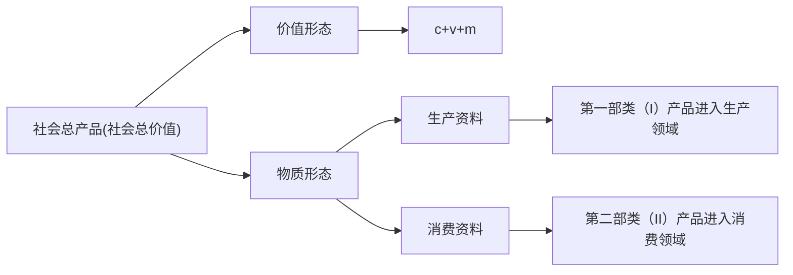

#### 工资与剩余价值的分配

##### 工资、利润和利润率

工人的工资表现为**劳动力的价值或价格**，这模糊了工人必要劳动和剩余劳动界限，掩盖了资本主义的剥削关系。因为实际上，工人的工资理应是**劳动的价格（即工人全部劳动的报酬）**。

`利润`实际上就是剩余价值，可以看作是全部预付资本的产物或说增加额。

`利润率`公式如下：
$$
利润率= \frac{剩余价值}{全部预付资本}
$$
为了得到尽可能高的利润率和尽可能的利润，大量资本**必然从利润率低的部门转向利润率高的部门**，形成了`利润平均化`的现象。

##### 平均利润

平均利润率又称“一般利润率”。是每年生产的剩余价值总额同资本家预付社会总资本的比率。平均利润率首先是由各个部门的不同[利润率平均化](https://baike.baidu.com/item/利润率平均化/8495103?fromModule=lemma_inlink)而形成的。**资本家为了追逐利润，总是把资本从利润率低的部门转移到利润率高的部门。**通过竞争和资本转移，引起供求关系和价格的变动，各个生产部门的利润率趋于平均化。平均利润率一经形成，各个部门的资本家所得的利润，就不再是他本部门所生产的剩余价值，而是每个资本按照它在社会总资本中所占的比例而取得的份额。这意味着不同部门的资本家按照等量资本得到等量利润的原则对剩余价值进行再分配。
$$
平均利润率 = \frac{剩余价值总量}{社会总资本}
$$

$$
平均利润= 预付资本\times 平均利润率
$$

$$
价格= 成本 + 平均利润
$$

这就导致在价值规律中，商品不再以价值而是生产价格作为基础进行交换。尽管这导致市场价格不再以价值为中心而**以生产价格**作为中心，这导致个别部门的生产价格和价值不相同，但从社会总体上来看，商品的产品价格总额和价值总额是相等的。

> 剩余价值理论深刻揭示资本主义生产关系的剥削本质，阐明资产阶级与无产阶级的经济根源，指出无产阶级革命的历史必然性。
>
> **由于唯物史观和剩余价值理论**的发现，社会主义从空想走向现实。 

### 资本主义的基本矛盾与经济危机

**生产社会化和生产资料资本主义私人占有之间的矛盾**，是资本主义的基本矛盾。

---

产生资本主义经济爆发的根本原因是资本主义的基本矛盾，而**具体表现在：**

1. 生产无限扩大的趋势和劳动人民有支付能力的需求相对缩小的矛盾
2. 单个企业内部生产的有组织性和整个社会生产的无政府状态之间的矛盾

# 资本主义的发展及其趋势

## 垄断资本主义的形成和发展

### 资本主义从自由竞争到垄断

Timeline：

生产集中和资本集中是资本家追求剩余价值的结果，而由于自由竞争形成的生产与资本的集中，资本主义必然最后走向垄断。

`垄断`是指少数资本主义大企业为了获取高额利润，通过相互协调或联合，对一个或几个部门商品的生产、销售和价格进行操纵和控制。

---

下面我们详细阐述垄断条件下的竞争的特点。

> 首先我们要明确的是：==垄断不能消除竞争，反而会使竞争更加激烈复杂。==这是由于：
>
> 1. 垄断没有消除竞争的经济条件，**没有改变生产资料的资本主义私有制，还促进了商品经济的进一步发展**
> 2. 垄断必需通过竞争来维持
> 3. 由于社会生产的复杂性，任何垄断组织都不可能把包罗万象的社会生产全部包下来

与自由竞争相比，垄断条件下的竞争展现的特点有：

1. 从竞争目的上看，垄断竞争不是为了超额利润，而是关注于==**高额垄断利润**和**巩固垄断地位**==
2. 从竞争手段上看，垄断竞争除了采取在自由竞争中的常规手段（诸如改进技术、提高劳动生产率、降低产品成本），还更多采取**非经济的手段**
3. 从竞争范围上看，垄断竞争从国内市场扩张到全球市场，加剧国际市场的竞争激烈程度并将竞争扩大到经济领域之外

==总之，垄断条件下的竞争带来了**很大的破坏性**。==

---

关于**金融资本和金融寡头**

随着生产集中和垄断的发展，`银行资本`从集中走向垄断，`工业资本`对银行的依赖增强。两者紧密的结合，形成了新型的垄断资本——`金融资本`。

`金融寡头`是金融资本的完全体，操纵着国民经济命脉，实际控制了国家政权，支配着大量**社会财富**，控制着**国家的经济命脉和上层建筑**。

---

关于**垄断利润和垄断价值**

`垄断利润`是垄断资本家凭借其在社会生产和流通中的垄断地位获得的**超过平均利润的高额利润**。他们可以获取高额利润的原因关键在于**垄断组织在经济生活中起到了决定性的作用**，从而阻止了**资本的自由转移**并限制了利润平均化的趋势。
$$
收益=成本+垄断利润
$$

### 垄断资本主义的发展

#### 国家垄断资本主义的形成及作用

`国家垄断资本主义`是国家政权和私人垄断资本融合的垄断资本主义，代表着**政权被私人绑架**。

>  国家垄断资本主义的产生源于：
>
> 1. 社会生产力的发展，要求资本主义生产资料在更大范围内被支配
> 2. 经济波动和经济危机的深化，要求国家垄断资本主义的产生
> 3. 缓和社会矛盾，协调利益关系（主要是财富两极分化问题和其引致的阶级对立问题

#### 金融垄断资本的发展

`金融自由化`是各国政府放松对银行利率的管制，实行浮动汇率制度，取消外汇管制，金融市场相互开放。

`金融创新`主要包括：远期合约、期货合约、期权合约、掉期合约。

#### 垄断资本向世界范围的扩展

**主要经济动因：**

1. 输出国内过剩资本
2. 将部分非要害的技术转移到其他国家来谋求垄断地位
3. 争夺市场
4. 保障原材料和能源的可靠来源

**产生的社会经济后果：**

1. 资本输出国加速了资本积累，增强来垄断资本的实力
2. 巩固并扩大了垄断资本的销售市场和投资场所
3. 对发展中国家的经济命脉形成控制

# 习题总结

1. 马克思主义诞生于==19世纪40年代==（1948）
2. 马克思主义的根本世界观和方法论是==辩证唯物主义和历史唯物主义==
3. 马克思主义产生以前，长期占据主导地位的历史观是==唯心史观==
4. 马克思主义产生的阶级基础和实践基础是==无产阶级作为一支独立的政治力量登上历史舞台==
5. 提出社会主义革命可能在一国或数国首先取得胜利论断的是==列宁==
6. 辩证法思想是黑格尔哲学体系的==合理内核==/马克思称黑格尔的辩证法为==合理内核==
7. 马克思和恩格斯的==学者和革命家的品质==，是他们创立马克思主义的重要条件
8. 马克思主义是科学，从根本上说在于它==始终严格地以客观事实为根据==
9. 辩证唯物主义与历史唯物主义之所以成为无产阶级的科学世界观和方法论，因为它是==最完备深刻而无片面性的学说==
10. 被誉为“工人阶级的圣经”的马克思主义经典著作是==资本论==
11. 马克思主义生命力的根源在于==以实践为基础的科学性与革命性的统一==
12. 理解马克思主义政治经济学的枢纽是==劳动二重性学说==
13. 费尔巴哈哲学的 “**基本内核**”是==唯物主义==
14. 马克思主义科学性和革命性的统一表现在==马克思主义的世界观和方法论 、马克思主义的政治立场、马克思主义的理论品质、马克思主义的社会理想==
15. 19世纪 30-40年代，标志着无产阶级反对资产阶级的阶级斗争进入新阶段的欧洲工人运动是==德国西里西亚工人起义 、法国里昂工人起义、英国工人宪章运动==
16. 坚持和弘扬**理论联系实际**的学风，就无需防止和反对==相对主义态度、经验主义态度==
17. 从 19世纪 40年代后半期起马克思与恩格斯一起先后改组和创建了共产主义组织：==共产主义者同盟、第一国际==
18. 科学社会主义是==马克思主义思想体系的核心、关于无产阶级解放运动的性质、条件、目的和发展规律的科学、马克思主义理论体系的基础==
19. ==马克思主义是一种意识形态==
20. ==唯物史观和剩余价值学说==使社会主义由空想成为科学
21. 马克思主义哲学是==时代精神的精华==
22. ==科学性==是马克思主义哲学与时俱进的内在根据
23. 唯物史观和唯心史观的分水岭是==是否站在人民立场==
24. 近代形而上学唯物主义把世界的本原归结为==物质的具体形态和结构==
25. 作为哲学范畴的“物质”是指==客观实在==
26. 时间是指物质运动的==顺序性==
27. 使物质世界分化为自然界和人类社会的历史前提，又是使自然界与人类社会统一起来的现实基础是==实践==
28. 从意识的起源上看，意识是==物质世界长期发展的产物==
29. 意识产生的决定性环节是==劳动==
30. 对立统一规律揭示了==事物发展的动力和源泉==
31. 中国古代哲学家公孙龙“白马非马”之说的错误在于割裂了==矛盾的普遍性和特殊性的关系==
32. 区分量变和质变的根本标志是看==事物的变化是否超出度的范围==
33. 在唯物辩证法的方法论体系中，==矛盾分析法==居于核心的地位
34. 辩证思维的高级形式是==抽象与具体==
35. 世界观决定方法论，==方法论影响世界观==
36. 近代形而上学唯物主义==不能把唯物主义贯彻到社会历史领域==
37. 唯物辩证法的总观点是：==普遍联系==、==永恒发展==
38. 联系的特点有：==普遍性、客观性、多样性、条件性==
39. 哲学意义上的新事物和旧事物**并不是**以事物出现的时间早晚来界定的，而是以其==是否符合事物发展的客观规律==、==是否具有强大的生命力==和==远大前途==来进行区分的。
40. 月晕而风，础润而雨，比喻从某些征兆可以推知将会发生的事情，==不属于因果联系==
41. 矛盾的普遍性和特殊性可以==相互依存、相互转化==
42. 过犹不及：犹：如同，指事情做过了头跟做得不够一样都是不合适的
43. **波浪式前进**,也称螺旋形上升运动
44. “前途是光明的，道路是曲折的。”这个论断的哲学依据是：（1）新生事物不可战胜的原理；（2）新陈代谢是宇宙普遍不可抗拒的规律；（3）否定之否定规律；（4）事物发展过程的前进性和曲折性相统一的原理 
45. 现代科学思维方法包括==控制方法、系统方法、信息方法、结构-功能方法、模型化方法==
46. 客观唯心主义认为==人的认识是上帝的启示或绝对精神的产物==，而主观唯心主义认为==认识是人们心灵的自由创造，是头脑里固有的==。
47. 古代朴素唯物主义把世界的本原归结为：==某种具体的“原初物质”==
48. 近代形而上学唯物主义，把物质归结为==自然科学意义上的原子==，而非==把物质等同于物质的具体形态==
49. 唯心主义运动观的根本错误在于==否认运动对物质的依赖性==
50. 广义和狭义相对论动摇了牛顿的绝对时空观
51. 社会生活在本质上是==实践的==
52. 意识就其形式而言是主观的，就其内容而言是客观的
53. 唯心主义历史观认为==社会意识决定社会存在==，人们的==思想动机==是社会发展的根本原因，否认社会发展的客观规律
54. 马克思主义以前的旧唯物主义都是“半截子”唯物主义，一==到社会历史领域，就陷入唯心主义==
55. 辩证法与形而上学对立的焦点在于==是否承认事物的内部矛盾是事物发展的动力==
56. 在唯物辩证法的理论体系中，==对立统一规律==是唯物辩证法的实质与核心
57. 唯物辩证法与唯心辩证法、诡辩论的重要区别==不在于==坚持联系的普遍性
58. 发展的实质是==新事物的产生和旧事物的灭亡==
59. 区分新事物和旧事物的根本标志是==是否符合事物发展的必然趋势==
60. ==原因和结果==是揭示事物引起与被引起关系的一对范畴
61. 必然性是有原因的，==偶然性也是有原因的==
62. 现实性范畴是指==现实存在的、合乎必然性的客观实在==
63. **认识的**客体是==主体实践和认识的对象==
64. 实践的中介是==各种形式的工具、手段及其运用的程序和方法==
65. 马克思主义实践观是==从主观与客观的关系中把握人的活动的==
66. 只有通过实践，客观事物才会成为认识的对象，才有人对客观事物的反应，表明==实践是认识的来源==
67. 唯物主义反映论与唯心主义先验论是==两条根本对立的认识路线==
68. ==认识是主体对客体的反映==，这是**一切唯物主义**都承认的观点
69. 辩证唯物主义认为感性认识与理性认识之间的关系是==对立统一的==
70. 由认识到实践的飞跃是更为重要的一次飞跃，因为==它能够指导实践和检验认识==
71. 真理的绝对性是指真理的==无条件性、无限性==
72. “百花齐放、百家争鸣”的方针是党确定的繁荣和发展社会主义科学和文化事业的重要指导方针，它是一个自觉运用==真理发展==的规律的正确方针。
73. 评价结果的正确与否依赖于==相关的正确的知识性认识==
74. 在实践中形成的、反映了人民群众的要求，对历史发展和社会进步起着促进作用的价值观，是==正确的价值观==
75. 在认识论上“跟着感觉走”是==否认理论对实践的指导作用==
76. 认识主体的属性有==自然性、 意识性 、社会性、实践性、创造性==
77. 人尚未观察到的星球==虽然是客观存在的事物，但是并没有成为认识主体的认知对象==，因此不是认识客体。
78. 实践是人的==感性物质活动、社会历史性活动 、自觉的能动性活动== 
79. 马克思主义实现了人类认识史上的伟大变革在于它：==批判继承前人认识论的成果 、把实践观点引入认识论、把辩证法运用于反映论、创立了能动的革命的反映论 、第一次科学地解决了认识的产生和发展规律问题==
80. 辩证唯物主义认为，主体和客体的关系是==改造和被改造的关系、反映和被反映的关系==
81. 反映、信息和选择是物质形态普遍具有的属性或能力 
82. ==信念与信仰==是人的认识过程中的非理性因素
83. 要正确实现从理性认识到实践的飞跃，必须做到==要使理论为群众所掌握，化为群众的自觉行动==
84. 把加强顶层设计和摸着石头过河相结合，体现了认识论上的==实践和认识的辩证统一、感性认识和理性认识的辩证统一、认识运动的不断反复和无限发展==
85. 马克思主义认识论认为，认识的辩证过程是==实践——认识——实践的无限循环==
86. 主观和客观、认识和实践的统一是==具体的、历史的==
87. 真理不是客观事物，但其是客观的（？
88. 马克思主义作为人类认识的成果是==绝对真理和相对真理的统一==
89. 真理具有==教育、激励==的功能
90. 价值评价是实践活动发展的==规范因素==
91. ==“彼亦一是非，此亦一是非”==出自《庄子 齐物论》，是唯心主义在真理判断标准方面的一个观点，相当于是否定任何[真理标准](https://baike.baidu.com/item/真理标准?fromModule=lemma_inlink)，是对真理客观性的否定，与[马克思主义哲学](https://baike.baidu.com/item/马克思主义哲学?fromModule=lemma_inlink)里面的真理检验标准相悖
92. ==实践标准实质上决不能完全地证实或驳倒人类的任何表象。==
93. 自然地理环境是==人类社会生存和发展的必要的条件==
94. 宗教是==支配人们日常生活的外部力量在人们头脑中的虚幻的反映==
95. 社会意识相对独立性表现的是==历史继承性==
96. 衡量生产力水平的客观尺度是==劳动资料特别是生产工具的发展水平==
97. 在现代生产中，==脑力劳动者==的质量和数量日益具有决定性的意义
98. 生产关系中最基本的关系是==生产资料所有制关系==
99. 社会生产方式是==生产力与生产关系的统一==
100. 经济基础是==由社会一定发展阶段的生产力所决定的生产关系的总和==
101. 政治上层建筑是在一定==意识形态==指导下建立起来的，是统治阶级意志的体现
102. 上层建筑的核心是==国家政权==
103. 从国家的起源看，国家是==阶级矛盾不可调和的产物==
104. 社会形态是==经济基础和上层建筑的统一==
105. 在**同一社会形态**的发展中，社会基本矛盾通常是通过==改革==的方式来解决的
106. 阶级在本质上是一个==经济==范畴
107. 阶级斗争作为一个哲学范畴，==指阶级利益根本冲突的对抗阶级之间的对立和斗争==
108. 马克思主义不主张==用改良代替社会革命==
109. ==改革==是社会历史发展的常态
110. 改革在人类历史上具有普遍性，它是==对社会体制进行调整和完善==
111. 社会主义改革的根本目的在于==解放和发展生产力，促进社会的全面进步==
112. 科学技术是推动社会历史发展的==“最高意义上的革命力量”==
113. 理解社会历史奥秘的“钥匙”是==劳动发展史==
114. 属于社会意识形式、不属于意识形态的有==物理学、数学、语言学、形式逻辑==
115. 政治法律思想是==随着阶级和国家的出现而产生的==
116. 生产力状况决定生产关系的性质
117. 政治上层建筑是在一定意识形态指导下建立起来的、政治上层建筑影响和制约观念上层建筑、二者都能反映经济基础 
118. 国家按照==地域==来划分国民
119. **社会形态**更替具有==统一性和多样性、必然性和选择性、前进性和曲折性==的特性
120. 阶级社会发展的动力有==社会基本矛盾、阶级斗争、社会革命、社会改革、科学技术==
121. 生产力的发展是==社会革命==的客观条件之一
122. 并非任何社会问题都是阶级问题，不要滥用马克思主义的阶级分析方法
123. 阶级斗争熄灭论是一种==否认整个社会主义历史阶段始终存在着阶级和阶级斗争的==修正主义谬论
124. 当今时代，科学活动与技术活动的联系越来越紧密，出现了科学技术化和技术科学化的趋势，科学和技术日益融为一体
125. 在社会发展中人人创造历史是不对的，==劳动人民才能创造历史==
126. 人口因素是社会发展的==非决定性因素==
127. 马克思主义根据社会存在与社会意识辩证关系的原理，提出==两个“划分”、两个“归结”==的思想，从而将社会形态的发展看作自然历史过程，揭示了人类社会发展的规律。
128. 马克思主义政治经济学研究对象是==社会生产关系==
129. 商品经济的基本矛盾是==私人劳动和社会劳动的矛盾==
130. 平均利润的形成==是部门之间竞争的结果==
131. 在物物交换中，商品价值表现为==交换价值==
132. 可以在观念上执行货币职能的是==价值尺度==，这是由于流通手段、储藏手段、支付手段和世界货币都需要现实货币的参与
133. 研究社会资本再生产的核心问题是==社会总产品的实现问题==
134. 产业资本循环具有决定性意义的阶段是==生产阶段==
135. 社会资本是==相互联系和相互依存的所有单个资本的总和==
136. 生产资本的职能是==在生产过程中生产出包含剩余价值的商品==
137. 个别劳动（时间）的社会性质，通过==商品的交换来体现==
138. 商品交换活动背后隐藏着人与人之间关系 
139. 商品内在的==使用价值和价值的矛盾==，其完备的外在表现形式是==商品与货币之间的对立==。（因为商品代表着诸多的各种的使用价值，而货币则是价值）
140. 劳动力商品价值决定的特殊性在于==它包含着历史和道德因素==
141. 资本主义**简单再生产**是指==资本家将工人所创造的剩余价值全部用于个人消费==，而生产过程只是在原有规模上重复进行。
142. `资本的价值构成`指的是资本中的**不变部分**与**可变的部分**之间的比例构成，而`资本有机构成`又被称为`资本技术构成`，具体指的是资本中的由技术构成并且是能够反映资本中的技术部分构成的变化的构成情况, 但是通常在表示方法上和价值构成是一样的，技术构成在一定意义上是对价值构成起到决定性作用的。
143. 分析资本主义生产过程是劳动过程和价值增值过程的统一，关键是运用==劳动二重性==
144. `劳动力`是指人的劳动能力，是人的体力和脑力的总和，也就是人用自己的脑力和体力从事某种具体劳动的的能力，即创造价值的能力。`劳动`是这种劳动能力的支出和耗费，也就是在进行价值创造的过程中对劳动力的使用。==所以就是：劳动的能力和使用这种能力。==[所以表面上工资是在支付劳动，实际上工资是在支付劳动力。](https://yz.chsi.com.cn/kyzx/politics/201006/20100617/97783339.html)
145. 资本主义经济危机周期性的物质基础是==大规模的固定资本更新==
146. 提高资本周转速度给企业带来的好处是==减少预付资本==。这是因为，资本的周转时间是由生产时间和流通时间构成的。资本周转时间较长，周转速度就较慢，**为了维持生产的连续性，需要投入的预付资本量就较大**；反之，资本周转时间较短，周转速度就较快，需要投入的预付资本量就较小。
147. 社会必要劳动时间是通过==简单劳动==为尺度衡量的
148. 如果部门劳动生产率下降，同一劳动在单位时间内创造的==使用价值减少，而单位产品的价值量增加==[解释](https://qb.zuoyebang.com/xfe-question/question/0a91056b3da2e5e0362ebb58b26559c2.html)
149. 货币之所以能够充当价值尺度，是因为它==本身也是商品，具有价值==。
150. 加快资本周转，可以增加年剩余价值量和提高年剩余价值率，根本是因为==实际起作用的可变资本变多了==
151. 产品不是商品，也==可以体现社会联系==
152. 商品经济产生的一般条件包括==（1）社会分工；（2）私有制出现，产品属于不同所有者==
153. 价格是价值的货币表现，价值决定价格 
154. 价值规律主要通过市场机制的相互制约促使价格围绕价值上下波动来实现的，市场机制主要包括：==价格机制==、竞争机制、供求机制
155. 交换价值首先表现为两个使用价值交换时的量的比例 
156. 价值需要通过交换来**体现**，然而使用价值不需要
157. 商品经济包括==商品生产、商品交换==
158. 资本主义生产过程的结果包括了==再创造劳动力价值==
159. 电子商务对资本周转速度有着重要影响：==（1）资本由货币资本转化为生产资本的时间；（2）资本由商品资本转化为货币资本的时间；（3）原材料储备时间==
160. 私人垄断资本普遍采用的企业组织形式包括：==卡特尔、辛迪加、托拉斯、康采恩==
161. 国家对社会经济活动实行间接调控中，仍包含==必要的行政手段==
162. 价值是商品的本质属性，它是==**交换价值**的基础==
163. ==**马克思的劳动价值论**为揭示资本主义生产方式的本质奠定了理论基础==。
164. 资本积累规模的大小取决于==对工人的剥削程度、预付资本量的大小、所用资本和所费资本之间的差额、劳动生产率的高低==
165. 资本积累和扩大再生产的客观必然性是由==剩余价值规律决定的、竞争规律决定的==
166. 资本主义基本矛盾主要表现在（基本矛盾的表现形式是）：==各个企业内部生产的有组织性和整个社会生产无政府状态之间的矛盾、社会生产无限扩大的趋势与有支付能力的需求相对狭小的矛盾、无产阶级与资产阶级之间的矛盾==
167. 使用价值是交换价值和价值的物质承担者，交换价值和价值寓于使用价值之中
168. 在自由竞争条件下，凡是资本家都有能获得平均利润，借贷资本家也不例外（错）。（🔍🤡 原因在于职能资本家能在自由竞争的条件下获得平均利润，而借贷的资本利息不会超过平均利润，则借贷资本家不会获得平均利润）
169. 社会再生产不仅是物质资料的再生产，同时又是==生产关系的再生产==
170. **预付资本的总周转**就是==固定资本和流动资本的平均周转==
171. 商品价格是商品价值的**货币表现**
172. 价值是商品的社会属性，它的本质是在物的外壳掩盖下的**商品生产者之间相互交换劳动的关系**，即生产关系
173. [**简单价值形式**](https://baike.baidu.com/item/简单价值形式/7346084#2)使商品的使用价值和价值这一内部矛盾表现为==两个商品之间的外部对立==
174. **货币形式**是指==一般等价物固定在黄金或白银==上，一切商品的价值都通过金或银来表示
175. 资本总公式的矛盾，是剩余价值规律与价值规律的矛盾（资本得到了增值，这样的过程表面上违背了价值规律，但说明了剩余价值的产生，离不开流通领域但不因为流通领域产生，直指劳动力成为商品的现状）
176. **劳动力**（作为一种）商品的特殊性主要是体现在它的使用价值上，这是劳动力商品关键
177. 资本主义生产过程是劳动过程和价值**增值**过程的统一
178. 产业资本家：生产，会创造价值；商业资本家：商业买卖，只能实现价值
179. ==银行利润在量上等于平均利润==，这是由于银行的实质是专门经营货币资本、充当债权人和债务人借贷关系的资本主义企业，虽然借贷资本带来的利润是小于平均利润的，但是通过服务和剥削银行雇员的方式，也能达到平均利润
180. ==剩余价值学说==是马克思**经济理论**的基石
181. 财富的源泉并非只是来自于**劳动**，同时也来源于**劳动对象**（物料），所以这说明了为何要建立劳动者拥有劳动资料和劳动对象的社会
182. 从**概念**到**判断**再到**推理**，是理性认知从低级到高级的发展过程
183. 马克思根据作为社会主体的人的发展状况，把人类历史划分为三种社会形态，它们分别是**人的依赖性社会（原始社会、奴隶社会、封建社会）、物的依赖性社会（资本主义）、个人全面发展的社会（共产主义）**
184. 阶级斗争对阶级社会发展的推动作用突出表现在==社会形态的变更==
185. 与原始社会、奴隶社会和封建社会相适应的经济形势是==简单商品经济==
186. 劳动力商品最为重要的特征是==其使用价值是价值和剩余价值的源泉==
187. 产业资本的连续循环是==流通过程和生产过程的统一==
188. 对立统一规律**不能**指明事物发展的方向
189. **具体劳动**将生产资料的价值转移到新产品中去
190. 最能体现资本主义国家实质的国家职能是**政治职能**
191. 只有通过竞争和价格波动，==商品才能实现等价交换==
192. 划分固定资本和流动资本的依据是==价值的周转方式==
193. ==劳动必须和自然物结合==才能创造出财富
195. ==价值评价是实践活动发展的规范因素==，要求其消除盲目性和随意性，服从于实践目标的实现
